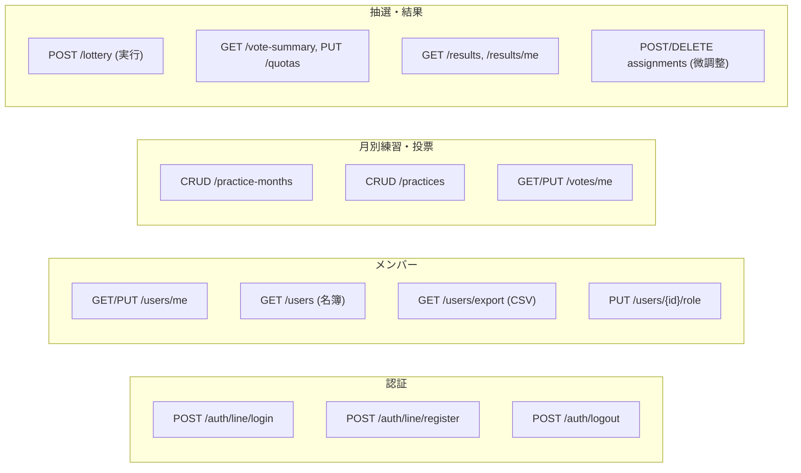

---
hide:
- navigation
doc_type: api-design
version: 2.2.0
last_updated: '2026-09-25'
depends_on:
- requirements/index.md
- database-design/index.md
derived_by:
- ui-design/index.md
sync_hash: ea8c5d33611d
dependency_hashes:
  requirements/index.md: 172f86034dfb
  database-design/index.md: '269413516489'
---

# API設計書 — サークル練習参加抽選システム

## 1. API概要

FastAPI で実装する RESTful API。フロントエンド (Next.js) から HTTP で呼び出される。リソースは大きく5つ: **認証 (auth)**、**メンバー (users)**、**月別練習 (practice-months / practices)**、**投票 (votes)**、**抽選・結果 (lottery / results)**。

## 2. 認証・認可

- **認証方式**: JWT Bearer Token（`Authorization: Bearer <token>`）
- ログイン成功時にアクセストークンを発行。以降のリクエストはすべてトークン必須（`/auth/*` の一部を除く）
- **ログインは LINE のみ**（D-021 / D-042）: LIFF が発行した ID トークンを `POST /auth/line/login` に送る。サーバーは LINE の検証エンドポイント（`https://api.line.me/oauth2/v2.1/verify`）に `id_token` と `client_id`（チャネルID）を送って検証し、応答の `sub` を LINE ユーザーIDとして本人を特定する。**クライアントから送られたユーザーIDは信用しない**（詐称を防ぐため）
- **代表も同じ経路**: 代表専用のログイン手段は設けない。メンバーとして LINE ログインしたうえで代表権限を付与する（D-042）
- **ロール**:

| ロール | 権限 |
|--------|------|
| member | 自分のプロフィール・投票・自分の抽選結果の操作のみ |
| representative（代表） | member の全権限 + 担当性別の日程管理・抽選実行・結果微調整 + 名簿閲覧（男女全体: REQ-007.1）+ 設定変更 |

- **性別スコープ** (NFR-002.4): 代表の操作系 API（日程・抽選・微調整）はトークンの `gender` と対象リソースの `gender` が一致しない場合 `403` を返す。名簿系 (`GET /users`, `GET /users/export`) のみ男女全体を返す。月別練習の閲覧系（一覧・詳細・公開後の参加表）は性別を問わず閲覧できる (D-038)。投票は自分の性別グループのみ (403)

## 3. 共通仕様

| 項目 | 仕様 |
|------|------|
| ベースURL | `/api/v1` |
| リクエスト/レスポンス形式 | JSON (UTF-8)。CSVエクスポートのみ `text/csv` |
| 日時形式 | ISO 8601。**レスポンスは必ずオフセット付きの UTC**（例: `2026-08-01T10:53:15.860494Z`）。リクエストはオフセット付きであれば任意のタイムゾーンを受け付け、サーバー側で UTC に正規化する。月は `YYYY-MM`（D-013） |
| ID形式 | プレフィックス付き ULID（例: `usr_01H...`） |
| ページネーション | 名簿一覧のみ `?page=&per_page=`（既定 per_page=50、150名規模のため任意） |
| レート制限 | 初期スコープでは設けない（150名規模のため） |

### エラーレスポンス

```json
{
  "error": {
    "code": "VALIDATION_ERROR",
    "message": "入力内容に誤りがあります",
    "details": [{ "field": "grade", "reason": "less_than_equal" }]
  }
}
```

| HTTP | code 例 | 意味 |
|------|---------|------|
| 400 | VALIDATION_ERROR | 入力不正 |
| 401 | UNAUTHORIZED | 未認証・トークン無効 |
| 403 | FORBIDDEN | 権限不足・性別スコープ違反 |
| 404 | NOT_FOUND | リソースが存在しない |
| 409 | CONFLICT | 状態の競合（締切後の投票、二重登録等） |

## 4. エンドポイント一覧



### 認証 (auth)

| メソッド | パス | 概要 | 権限 | 要件 |
|----------|------|------|------|------|
| POST | /auth/line/login | LINE ログイン（LIFF の ID トークンを検証。未登録なら `registered: false`） | 不要 | REQ-001.1, REQ-001.6 |
| POST | /auth/line/register | 初回登録（本名・学年・性別を受け取り会員作成。JWT を発行） | 不要 | REQ-001.5 |
| POST | /auth/logout | ログアウト（Cookie を破棄。呼び出す画面は未提供） | member | REQ-001.3 |

### メンバー (users)

| メソッド | パス | 概要 | 権限 | 要件 |
|----------|------|------|------|------|
| GET | /users/me | 自分のプロフィール取得 | member | REQ-002 |
| PUT | /users/me | 自分のプロフィール更新 | member | REQ-002.2 |
| GET | /users | 名簿一覧（検索・絞り込み。男女全体） | 代表 | REQ-007.1, REQ-007.1.1 |
| GET | /users/export | 名簿CSVエクスポート（絞り込み反映） | 代表 | REQ-007.1.2 |
| PUT | /users/{userId}/role | 代表権限の付与・剥奪（男女全体: D-040） | 代表 | REQ-007.2 |
| DELETE | /users/{userId} | メンバー無効化（論理削除） | 代表 | REQ-007.3 |

### 月別練習 (practice-months / practices)

| メソッド | パス | 概要 | 権限 | 要件 |
|----------|------|------|------|------|
| GET | /practice-months | 月別練習の一覧（既定は自性別。`?gender=` で他方も閲覧可 (D-038)。`?year_month=` 絞り込み） | member | REQ-004.1 |
| POST | /practice-months | 月別練習単位の作成（投票期間含む） | 代表 | REQ-003, REQ-003.3 |
| GET | /practice-months/{pmId} | 詳細（練習日一覧含む） | member | REQ-004.1 |
| PUT | /practice-months/{pmId} | 投票期間・枠比率等の更新 | 代表 | REQ-003.3, REQ-005.5 |
| POST | /practice-months/{pmId}/practices | 練習日の追加 | 代表 | REQ-003.1, REQ-003.2 |
| GET | /practices/suggestions | よく使う練習の候補（履歴から） | 代表 | REQ-003.6 |
| PUT | /practices/{practiceId} | 練習日の更新 | 代表 | REQ-003.4 |
| DELETE | /practices/{practiceId} | 練習日の削除（抽選後は警告フラグ） | 代表 | REQ-003.4 |

### 投票 (votes)

| メソッド | パス | 概要 | 権限 | 要件 |
|----------|------|------|------|------|
| GET | /practice-months/{pmId}/votes/me | 自分の投票状況 | member | REQ-004.4 |
| PUT | /practice-months/{pmId}/votes/me | 投票の登録・変更（practice_id の配列で全置換） | member | REQ-004.2, REQ-004.3 |

- 締切後 (`vote_ends_at` 超過) の PUT は `409 CONFLICT` を返す (REQ-004.3)

### 抽選・結果 (lottery / results)

| メソッド | パス | 概要 | 権限 | 要件 |
|----------|------|------|------|------|
| GET | /practice-months/{pmId}/vote-summary | 抽選前の投票状況と学年別枠（提案値含む） | 代表 | REQ-005.5, REQ-005.5.1 |
| PUT | /practice-months/{pmId}/quotas | 学年別の参加人数枠を保存（合計＝定員） | 代表 | REQ-005.3 |
| POST | /practice-months/{pmId}/lottery | 抽選の一括実行（再実行含む。枠未設定なら409） | 代表 | REQ-005, REQ-005.12 |
| GET | /practice-months/{pmId}/executions | 抽選実行履歴 | 代表 | REQ-005.11 |
| GET | /practice-months/{pmId}/results/me | 自分の当選結果（公開後のみ） | member | REQ-006.1 |
| GET | /practice-months/{pmId}/participation | 練習参加表（学年別。全メンバーを並べ、未投票は `has_voted = false`。公開後のみ: D-043） | member | REQ-006.5 |
| GET | /practice-months/{pmId}/results | 全結果（練習日別・メンバー別） | 代表 | REQ-006.2 |
| POST | /practices/{practiceId}/assignments | 参加者の手動追加 | 代表 | REQ-006.3 |
| DELETE | /assignments/{assignmentId} | 参加者の手動削除 | 代表 | REQ-006.3 |
| POST | /practice-months/{pmId}/publish | 結果の公開 | 代表 | REQ-006.4 |

- 未公開 (`status != published`) の `/results/me` は `404` を返す (REQ-006.4)
- 公開後の微調整は `assignments.publish_state` で保留され、メンバー向けの `/results/me`・`/participation` には再公開まで反映されない。`POST /publish` は公開済みの月にも実行でき、再公開として保留分を確定する (D-044)
- `GET /results` の `by_member` は性別グループの**全メンバー**を返す。未投票者も `votes_count = 0` で含める（誰が投票していないかを結果画面で把握するため: D-043）
- 抽選の再実行時は既存の有効な実行が `is_active = false` になり、割当が置き換わる (REQ-005.12)

### 設定 (settings)

| メソッド | パス | 概要 | 権限 | 要件 |
|----------|------|------|------|------|
| GET | /settings | 抽選設定の取得（担当性別） | 代表 | NFR-004.1 |
| PUT | /settings | 落選救済係数 α の更新 | 代表 | NFR-004.1 |

## 5. API仕様詳細

<swagger-ui src="openapi.yaml"/>

詳細は [openapi.yaml](openapi.yaml) を参照。

## 6. 要件トレーサビリティ

| 要件 | 対応エンドポイント |
|------|--------------------|
| REQ-001 (認証) | POST /auth/line/login, /auth/line/register, /auth/logout |
| REQ-002 (プロフィール) | GET/PUT /users/me |
| REQ-003 (練習日程管理) | POST/PUT /practice-months, POST/PUT/DELETE /practices, GET /practices/suggestions |
| REQ-004 (投票) | GET /practice-months, GET/PUT /practice-months/{pmId}/votes/me |
| REQ-005 (抽選) | POST /practice-months/{pmId}/lottery, GET /vote-summary, PUT /quotas, GET /executions |
| REQ-006 (抽選結果) | GET /results/me, GET /results, GET /participation, POST/DELETE assignments, POST /publish |
| REQ-007 (メンバー管理) | GET /users, GET /users/export, PUT /users/{userId}/role, DELETE /users/{userId} |
| NFR-002.3〜4 (アクセス制御) | 全エンドポイントのロール・性別スコープ検証 (403) |
| NFR-004.1 (設定変更) | GET/PUT /settings, PUT /practice-months/{pmId} (grade2_ratio) |
