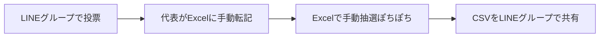

---
hide:
- navigation
doc_type: business-plan
version: 2.0.0
last_updated: '2026-09-18'
depends_on: []
derived_by:
- requirements/index.md
sync_hash: 95db25dcaa0b
dependency_hashes: {}
---

# 事業計画書 — サークル練習参加抽選システム

## 1. エグゼクティブサマリー

約150名が在籍する大学バレーボールサークルにおいて、毎月の練習参加者の抽選を自動化する Web システムを開発する。現在は LINE グループでの投票と Excel での手動抽選により代表に大きな運用負荷がかかっており、本システムはメンバーの投票から抽選実行・結果確認までをオンラインで完結させる。学年・投票数・落選履歴などを考慮した公平な重み付き抽選アルゴリズムを核とし、代表の作業時間を大幅に削減するとともに、メンバーにとって納得感のある参加機会の分配を実現する。

## 2. プロジェクト背景・課題

### 現状の運用フロー

### 課題

| # | 課題 | 影響 |
|---|------|------|
| 1 | 150名分の投票を代表が手動で Excel に転記・抽選している | 代表の作業負荷が非常に大きい（毎月発生） |
| 2 | 結果共有が CSV ファイルのため見づらい | 各自が自分の参加日を探す手間がかかる |
| 3 | 落選履歴や参加実績が体系的に管理されていない | 「ずっと落選し続ける人」を救済できない |

## 3. ソリューション概要

Web ブラウザから利用できる練習参加抽選システムを提供する。

### 一般メンバー向け機能

1. LINE ログイン（LIFF）で本人を識別する
2. 初回のみプロフィール登録（本名・学年・性別・マネージャー区分）
3. 月ごとに参加したい練習日へ投票
4. 抽選後、自分の参加日を確認

### 代表（管理者）向け機能

1. 月の練習日・練習場所・練習ごとの参加定員を登録
2. 練習日ごと・学年ごとの参加人数枠を設定（投票状況を見ながら調整）
3. 抽選の一括実行（月単位・ボタン一つ）
4. 抽選結果の見やすい表示
5. 抽選後の手動微調整
6. メンバー名簿（本名・学年・性別・マネージャー区分）の閲覧

### 抽選アルゴリズムの方針（本システムの核）

- **男女別の独立抽選**: 男子代表・女子代表がそれぞれ自分の担当の抽選を独立して実行する
- **マネージャーは定員外で全参加**: プレイヤーではないため定員に数えず、投票日すべてに参加する
- **学年別の独立抽選**: 練習日ごとに1〜3年の参加人数枠を代表が設定し、各学年は自分の枠の中で独立に抽選する。上級生優先の度合いは、月や日の投票状況を見て代表が判断する (D-015)
- **枠の初期値はシステムが提案**: 定員の等分を基準に、その日の学年別投票者数を反映した提案値を表示する。代表は画面上で自由に増減できる (D-031)
- **最低1回保証（最優先）**: 投票したのに月1回も参加できないメンバーを作らない
- **投票数比例**: 保証後の残枠は、多く投票したメンバーほど多く参加できるように配分する
- **余り枠は学年をまたいで再配分**: 投票者が足りず余った枠は空席にせず、他学年へ1人ずつ順に回して定員を埋める (D-027)
- **落選救済**: 前月に落選したメンバーの当選確率を引き上げ、連続落選を防ぐ

## 4. ターゲットユーザー

| ユーザー | 人数規模 | 主な利用シーン |
|----------|----------|----------------|
| 一般メンバー | 約150名（男女混成・大学1〜3年、各性別約70名） | 月1回の投票、抽選結果の確認（スマホ利用が中心） |
| 男子代表 | 1名 | 男子メンバーの練習日程登録・抽選実行・調整 |
| 女子代表 | 1名 | 女子メンバーの練習日程登録・抽選実行・調整 |
| マネージャー | 若干名 | 一般メンバーと同様に投票するが、定員外で全参加 |

## 5. 運用方針

- 営利目的ではなく、自サークル内部の運営効率化ツールとして無償運用する。他サークルへの横展開は想定しない
- ホスティングは Vercel（フロントエンド）/ Render（バックエンド）/ Supabase（データベース）を使用する
- バックエンドはコールドスタートの回避と稼働の安定性を優先し、Render の有料プランを利用する

## 6. 開発ロードマップ

| フェーズ | 内容 | 補足 |
|----------|------|------|
| Phase 1 | 要件定義・設計（要件定義書 / DB / API / UI / インフラ） | /requirements 〜 /infrastructure-design |
| Phase 2 | バックエンド構築（FastAPI 初期化・認証・プロフィール・練習日程・投票 API） | /backend-init, /backend-api-develop |
| Phase 3 | 抽選エンジン実装（Pythonモジュール・シード決定的・単体テスト） | 本システムの核。性質テストで公平性を検証 |
| Phase 4 | フロントエンド構築（メンバー画面・代表管理画面） | /frontend-init, /frontend-develop。全画面モバイルファースト |
| Phase 5 | 試験運用（1ヶ月分の実データで並行運用）→ 本番移行 | — |

## 7. 成功指標

本システムが目指すのは、代表の月次抽選作業の負荷軽減のみである。投票率などメンバー側の行動目標は設けない。

| 指標 | 現状 | 目標 |
|-----|------|------|
| 代表の月次抽選作業時間 | 数時間（手動） | 15分以内（日程登録 + 枠設定 + ボタン実行 + 微調整） |

## 8. リスクと対策

| リスク | 対策 |
|--------|------|
| 個人情報（本名・LINE ユーザーID）の漏洩 | アクセス制御（名簿の閲覧は代表のみ）、HTTPS 必須。LINE ユーザーIDは画面にも API レスポンスにも出さない |
| 抽選ロジックへの不信・不公平感 | アルゴリズムをドキュメントで明文化し、乱数シードや実行履歴を記録 |
| 150名の移行ハードル（LINE から Web へ） | スマホ最適化 UI、LINE ログインによる初回登録の簡素化、LINE での URL 周知 |
| 代表交代時の引き継ぎ | 設定画面からの代表権限の付与、運用手順のドキュメント化 |
