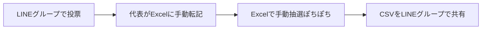

---
hide:
- navigation
doc_type: business-plan
version: 1.3.1
last_updated: '2026-07-08'
depends_on: []
derived_by:
- requirements/index.md
sync_hash: 8aa8f5dc0336
dependency_hashes: {}
---

# 事業計画書 — サークル練習参加抽選システム

## 1. エグゼクティブサマリー

約150名が在籍する大学バレーボールサークルにおいて、毎月の練習参加者の抽選を自動化する Web システムを開発する。現在は LINE グループでの投票と Excel での手動抽選により代表に大きな運用負荷がかかっており、本システムはメンバーの投票から抽選実行・結果確認までをオンラインで完結させる。学年・投票数・落選履歴などを考慮した公平な重み付き抽選アルゴリズムを核とし、代表の作業時間を大幅に削減するとともに、メンバーにとって納得感のある参加機会の分配を実現する。

## 2. プロジェクト背景・課題

### 現状の運用フロー

### 課題

| # | 課題 | 影響 |
|---|------|------|
| 1 | 150名分の投票を代表が手動で Excel に転記・抽選している | 代表の作業負荷が非常に大きい（毎月発生） |
| 2 | 抽選基準が属人的で、公平性の担保・説明が難しい | メンバーの不満・納得感の欠如につながる |
| 3 | 結果共有が CSV ファイルのため見づらい | 各自が自分の参加日を探す手間がかかる |
| 4 | 落選履歴や参加実績が体系的に管理されていない | 「ずっと落選し続ける人」を救済できない |
| 5 | 個人情報（住所・電話番号等）の管理が分散している | 情報管理のリスク |

## 3. ソリューション概要

Web ブラウザから利用できる練習参加抽選システムを提供する。

### 一般メンバー向け機能

1. メールアドレス + パスワードでログイン
2. プロフィール登録（名前・住所・電話番号・メールアドレス・学年・性別・学部学科・学籍番号・マネージャー区分）
3. 月ごとに参加したい練習日へ投票
4. 抽選後、自分の参加日を確認

### 代表（管理者）向け機能

1. 月の練習日・練習場所・練習ごとの参加定員を登録
2. 抽選の一括実行（月単位・ボタン一つ）
3. 抽選結果の見やすい表示
4. 抽選後の手動微調整
5. メンバーの個人情報（メールアドレス・学籍番号等）の閲覧

### 抽選アルゴリズムの方針（本システムの核）

- **男女別の独立抽選**: 男子代表・女子代表がそれぞれ自分の担当の抽選を独立して実行する
- **マネージャーは定員外で全参加**: プレイヤーではないため定員に数えず、投票日すべてに参加する
- **3年生は全通し**: 3年生（約10名/性別）は投票した練習日すべてに当選する（学年が上ほど優先の方針を枠として明確化）
- **1・2年は学年別の独立抽選**: 1年生の人数が多いため同じ土俵で競わせず、残枠を学年別の枠に分割して各学年内で独立に抽選する（枠比率は代表が毎月設定）
- **最低1回保証（最優先）**: 投票したのに月1回も参加できないメンバーを作らない
- **投票数比例**: 保証後の残枠は、多く投票したメンバーほど多く参加できるように配分する
- **月内平準化**: 同一月内で特定メンバーに当選が偏らないよう調整する
- **落選救済**: 過去に落選したメンバーの当選確率を引き上げ、連続落選を防ぐ

## 4. ターゲットユーザー

| ユーザー | 人数規模 | 主な利用シーン |
|----------|----------|----------------|
| 一般メンバー | 約150名（男女混成・大学1〜3年、各性別約70名） | 月1回の投票、抽選結果の確認（スマホ利用が中心） |
| 男子代表 | 1名 | 男子メンバーの練習日程登録・抽選実行・調整 |
| 女子代表 | 1名 | 女子メンバーの練習日程登録・抽選実行・調整 |
| マネージャー | 若干名 | 一般メンバーと同様に投票するが、定員外で全参加 |

## 5. ビジネスモデル

- 営利目的ではなく、サークル内部の運営効率化ツールとして無償運用する
- 運用コストは無料枠のあるクラウドサービス（例: Vercel / Render / Supabase / Neon 等）を活用して最小化する
- 将来的に他サークルへの横展開が可能な汎用設計を意識するが、初期スコープは自サークル専用とする

## 6. 市場分析

- 大学サークル・部活動における「参加調整」は LINE 投票 + 手作業が主流であり、専用ツールはほぼ存在しない
- 汎用日程調整ツール（調整さん・LINEスケジュール等）は「全員参加前提の日程決め」が目的で、**定員付き抽選**のユースケースをカバーしない
- 同様の課題（施設定員 > 希望者）を持つ大規模サークルは多く、潜在的な横展開余地がある

## 7. 競合分析

| ツール | 定員管理 | 重み付き抽選 | 個人情報管理 | 評価 |
|--------|----------|--------------|--------------|------|
| LINE投票 + Excel（現状） | 手動 | 手動・属人的 | 分散 | 運用負荷が大きい |
| 調整さん等の日程調整ツール | ✕ | ✕ | ✕ | 抽選に非対応 |
| 汎用抽選ツール | ✕ | ✕ | ✕ | 定員・履歴・公平性に非対応 |
| **本システム** | ◯ | ◯（学年・履歴・投票数考慮） | ◯ | 課題に完全対応 |

## 8. 開発ロードマップ

| フェーズ | 内容 | 補足 |
|----------|------|------|
| Phase 1 | 要件定義・設計（要件定義書 / DB / API / UI / インフラ） | /requirements 〜 /infrastructure-design |
| Phase 2 | バックエンド構築（FastAPI 初期化・認証・プロフィール・練習日程・投票 API） | /backend-init, /backend-api-develop |
| Phase 3 | 抽選エンジン実装（Pythonモジュール・シード決定的・単体テスト） | 本システムの核。性質テストで公平性を検証 |
| Phase 4 | フロントエンド構築（メンバー画面・代表管理画面） | /frontend-init, /frontend-develop。全画面モバイルファースト |
| Phase 5 | 試験運用（1ヶ月分の実データで並行運用）→ 本番移行 | — |

## 9. KPI・成功指標

| KPI | 現状 | 目標 |
|-----|------|------|
| 代表の月次抽選作業時間 | 数時間（手動） | 15分以内（日程登録 + ボタン実行 + 微調整） |
| メンバーの投票率 | LINE投票ベース | 90%以上を維持 |
| 「月0回参加」の投票者数 | 発生しうる | 0名（最低1回保証） |
| 抽選結果への不満・問い合わせ | 属人的で説明困難 | アルゴリズムの明文化により削減 |

## 10. リスクと対策

| リスク | 対策 |
|--------|------|
| 個人情報（住所・電話番号等）の漏洩 | アクセス制御（代表のみ閲覧可）、パスワードハッシュ化、HTTPS 必須 |
| 抽選ロジックへの不信・不公平感 | アルゴリズムをドキュメントで明文化し、乱数シードや実行履歴を記録 |
| 150名の移行ハードル（LINE から Web へ） | スマホ最適化 UI、初回登録の簡素化、LINE での URL 周知 |
| 代表交代時の引き継ぎ | 管理者権限の移譲機能、運用手順のドキュメント化 |
| 無料枠クラウドのサービス制限 | 月次利用（アクセス集中は投票期間のみ）のため負荷は小さい。移行可能な構成にする |
