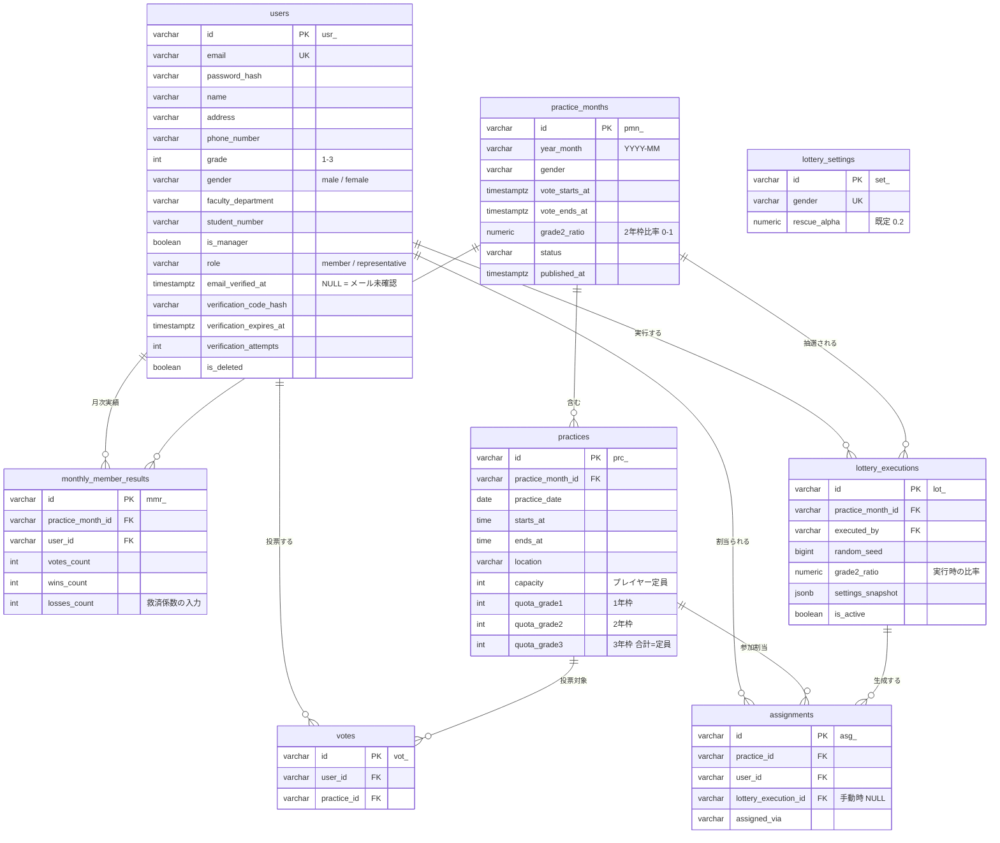

---
hide:
- navigation
doc_type: database-design
version: 1.2.0
last_updated: '2026-07-08'
depends_on:
- requirements/index.md
derived_by:
- api-design/index.md
sync_hash: df1f268c47a3
dependency_hashes:
  requirements/index.md: 2c207f7157b0
---

# DB設計書 — サークル練習参加抽選システム

## 1. 概要

PostgreSQL + SQLAlchemy (ORM) を使用する。設計方針:

- 主キーは `id` (varchar、テーブル別プレフィックス付き ULID。例: `usr_01H...`)
- 全テーブルに `created_at` / `updated_at` を付与
- 論理削除は `is_deleted` (boolean)
- JSON型は `jsonb`
- 「月 × 性別」を抽選運用の単位とし、`practice_months` が投票期間・枠比率・公開状態を持つ
- 抽選は再実行可能なため、実行のたびに `lottery_executions` を追加し、最新の有効な実行 (`is_active = true`) の割当のみを結果として扱う
- 落選救済の入力となる月次集計は `monthly_member_results` に保存する（結果公開時に確定）

## 2. ER図

## 3. テーブル定義

### users — メンバー

| カラム | 型 | 制約 | 説明 |
|--------|----|------|------|
| id | varchar(30) | PK | `usr_` + ULID |
| email | varchar(255) | NOT NULL, UNIQUE | ログインID |
| password_hash | varchar(255) | NOT NULL | bcrypt ハッシュ |
| name | varchar(100) | NOT NULL | 氏名 |
| address | varchar(255) | NOT NULL | 住所 |
| phone_number | varchar(20) | NOT NULL | 電話番号 |
| grade | integer | NOT NULL, CHECK (1〜3) | 学年 |
| gender | varchar(10) | NOT NULL, CHECK (male / female) | 抽選グループの決定に使用 |
| faculty_department | varchar(100) | NOT NULL | 学部学科 |
| student_number | varchar(30) | NOT NULL | 学籍番号 |
| is_manager | boolean | NOT NULL, DEFAULT false | マネージャー区分（定員外・全参加） |
| role | varchar(20) | NOT NULL, DEFAULT 'member' | member / representative（代表。担当範囲は自分の gender） |
| email_verified_at | timestamptz | NULL 許容 | NULL = メール未確認。確認済みになるまでログイン不可 (D-012) |
| verification_code_hash | varchar(255) | NULL 許容 | 6桁確認コードの bcrypt ハッシュ。平文では保持しない |
| verification_expires_at | timestamptz | NULL 許容 | コードの有効期限（発行から15分） |
| verification_attempts | integer | NOT NULL, DEFAULT 0 | 入力失敗回数。5回で無効化し再送を促す |
| is_deleted | boolean | NOT NULL, DEFAULT false | 退会（論理削除） |
| created_at / updated_at | timestamptz | NOT NULL | — |

インデックス: `(gender, grade)`, `(role)` ／ 一意制約: `email`

### practice_months — 月別抽選単位（月 × 性別）

| カラム | 型 | 制約 | 説明 |
|--------|----|------|------|
| id | varchar(30) | PK | `pmn_` + ULID |
| year_month | varchar(7) | NOT NULL | 'YYYY-MM' |
| gender | varchar(10) | NOT NULL | 男女で独立した抽選単位 (REQ-005.1) |
| vote_starts_at | timestamptz | NOT NULL | 投票受付開始 (REQ-003.3) |
| vote_ends_at | timestamptz | NOT NULL | 投票締切。以降は投票変更不可 |
| grade2_ratio | numeric(3,2) | NULL | 2年枠比率 0〜1（抽選実行前に代表が設定。前月値を初期表示） |
| status | varchar(20) | NOT NULL, DEFAULT 'draft' | draft / voting / closed / drawn / published |
| published_at | timestamptz | NULL | 結果公開日時 (REQ-006.4) |
| is_deleted | boolean | NOT NULL, DEFAULT false | — |
| created_at / updated_at | timestamptz | NOT NULL | — |

一意制約: `(year_month, gender)`

### practices — 練習日

| カラム | 型 | 制約 | 説明 |
|--------|----|------|------|
| id | varchar(30) | PK | `prc_` + ULID |
| practice_month_id | varchar(30) | NOT NULL, FK → practice_months | — |
| practice_date | date | NOT NULL | 練習日 |
| starts_at | time | NOT NULL | 開始時刻 |
| ends_at | time | NOT NULL | 終了時刻 |
| location | varchar(255) | NOT NULL | 練習場所 |
| capacity | integer | NOT NULL, CHECK (> 0) | プレイヤー定員（マネージャーは含まない: REQ-005.2） |
| quota_grade1 | integer | NULL 許容 | 1年の参加人数枠。抽選前に代表が設定 (REQ-005.3 / D-015) |
| quota_grade2 | integer | NULL 許容 | 2年の参加人数枠 |
| quota_grade3 | integer | NULL 許容 | 3年の参加人数枠。**3学年の合計 = capacity**。NULL が1つでもあると抽選は実行できない |
| is_deleted | boolean | NOT NULL, DEFAULT false | 抽選後の削除は警告付き (REQ-003.4) |
| created_at / updated_at | timestamptz | NOT NULL | — |

インデックス: `(practice_month_id, practice_date)`

### votes — 投票

| カラム | 型 | 制約 | 説明 |
|--------|----|------|------|
| id | varchar(30) | PK | `vot_` + ULID |
| user_id | varchar(30) | NOT NULL, FK → users | — |
| practice_id | varchar(30) | NOT NULL, FK → practices | — |
| is_deleted | boolean | NOT NULL, DEFAULT false | 投票の取消（締切前のみ: REQ-004.3） |
| created_at / updated_at | timestamptz | NOT NULL | — |

一意制約: `(user_id, practice_id)` ／ インデックス: `(practice_id)`

### lottery_executions — 抽選実行履歴 (REQ-005.11)

| カラム | 型 | 制約 | 説明 |
|--------|----|------|------|
| id | varchar(30) | PK | `lot_` + ULID |
| practice_month_id | varchar(30) | NOT NULL, FK → practice_months | — |
| executed_by | varchar(30) | NOT NULL, FK → users | 実行した代表 |
| random_seed | bigint | NOT NULL | 同一シードで結果を再現可能 |
| grade2_ratio | numeric(3,2) | NULL 許容 | **D-015 で廃止**。以前の実行履歴のみ値を持つ |
| settings_snapshot | jsonb | NOT NULL | 実行時のスナップショット。`rescue_alpha` / `warnings` / **`quotas`（練習日ごとの学年別枠: D-015）** |
| is_active | boolean | NOT NULL, DEFAULT true | 再実行時 (REQ-005.12) は旧実行を false にする |
| is_deleted | boolean | NOT NULL, DEFAULT false | — |
| created_at / updated_at | timestamptz | NOT NULL | — |

インデックス: `(practice_month_id, is_active)`

### assignments — 参加割当（抽選結果）

| カラム | 型 | 制約 | 説明 |
|--------|----|------|------|
| id | varchar(30) | PK | `asg_` + ULID |
| practice_id | varchar(30) | NOT NULL, FK → practices | — |
| user_id | varchar(30) | NOT NULL, FK → users | — |
| lottery_execution_id | varchar(30) | NULL, FK → lottery_executions | 代表の手動調整 (REQ-006.3) 時は NULL |
| assigned_via | varchar(20) | NOT NULL | manager / grade3 / guaranteed / distribution / overflow / manual |
| is_deleted | boolean | NOT NULL, DEFAULT false | 微調整での取消に使用 |
| created_at / updated_at | timestamptz | NOT NULL | — |

一意制約: `(practice_id, user_id)`（is_deleted = false の行に対する部分一意インデックス）

`assigned_via` はアルゴリズムのどの Phase で割当られたかを記録する（公平性の事後検証用）:

| 値 | 由来 |
|----|------|
| manager | Phase 0: マネージャー（定員外） |
| grade3 | Phase 0: 3年生確定 |
| guaranteed | Phase 2-a: 最低1回保証 |
| distribution | Phase 2-b: 残枠配分 |
| overflow | Phase 3: 余剰枠の流し込み |
| manual | 代表の手動微調整 |

### monthly_member_results — 月次メンバー実績（落選救済の入力: REQ-005.9）

| カラム | 型 | 制約 | 説明 |
|--------|----|------|------|
| id | varchar(30) | PK | `mmr_` + ULID |
| practice_month_id | varchar(30) | NOT NULL, FK → practice_months | — |
| user_id | varchar(30) | NOT NULL, FK → users | — |
| votes_count | integer | NOT NULL | その月の投票数 |
| wins_count | integer | NOT NULL | 当選数 |
| losses_count | integer | NOT NULL | 落選数（votes_count − wins_count）。翌月の救済係数 1 + α × losses_count に使用 |
| is_deleted | boolean | NOT NULL, DEFAULT false | — |
| created_at / updated_at | timestamptz | NOT NULL | — |

一意制約: `(practice_month_id, user_id)`。結果公開 (published) 時に確定・保存する。

### lottery_settings — 抽選設定 (NFR-004.1)

| カラム | 型 | 制約 | 説明 |
|--------|----|------|------|
| id | varchar(30) | PK | `set_` + ULID |
| gender | varchar(10) | NOT NULL, UNIQUE | 性別グループごとに独立した設定 |
| rescue_alpha | numeric(3,2) | NOT NULL, DEFAULT 0.2 | 落選救済係数 α |
| is_deleted | boolean | NOT NULL, DEFAULT false | — |
| created_at / updated_at | timestamptz | NOT NULL | — |

## 4. DBML スキーマ

[schema.dbml](schema.dbml) を参照。

## 5. マイグレーション方針

- Alembic を使用する（`/backend-db-migrate` スキル。モデルの正本は `backend/` の SQLAlchemy モデルで、本書の DBML と同期させる）
- マイグレーションファイルは `backend/migrations/` に生成し、自動生成後に必ず内容をレビューする
- 初期データ（`lottery_settings` の男女2行、初期代表アカウント）はシードスクリプトで投入する（`/backend-db-seed` スキル）
- 破壊的変更（カラム削除・型変更）は expand → migrate → contract の3段階で行う

## 6. 要件トレーサビリティ

| 要件 | 対応するテーブル / カラム |
|------|--------------------------|
| REQ-001 (認証) | users.email, users.password_hash |
| REQ-002 (プロフィール) | users の各プロフィールカラム |
| REQ-003 (練習日程管理) | practice_months, practices (capacity, vote_starts_at, vote_ends_at) |
| REQ-004 (投票) | votes, practice_months.status |
| REQ-005.1 (男女独立) | practice_months.gender, lottery_settings.gender |
| REQ-005.2 (マネージャー定員外) | users.is_manager, assignments.assigned_via = 'manager' |
| REQ-005.3 (3年生全通し) | users.grade, assignments.assigned_via = 'grade3' |
| REQ-005.4〜5 (学年枠・比率設定) | practice_months.grade2_ratio, lottery_executions.grade2_ratio |
| REQ-005.6〜8 (保証・比例・平準化) | assignments.assigned_via (guaranteed / distribution) |
| REQ-005.9 (落選救済) | monthly_member_results.losses_count, lottery_settings.rescue_alpha |
| REQ-005.10 (余剰枠流し込み) | assignments.assigned_via = 'overflow' |
| REQ-005.11 (実行履歴・再現性) | lottery_executions (random_seed, settings_snapshot) |
| REQ-005.12 (再実行) | lottery_executions.is_active |
| REQ-006.3 (手動微調整) | assignments.assigned_via = 'manual', lottery_execution_id = NULL |
| REQ-006.4 (公開制御) | practice_months.status, published_at |
| REQ-007.2 (代表権限) | users.role |
| REQ-007.3 (退会・論理削除) | users.is_deleted |
| NFR-004.1 (設定変更) | lottery_settings, practice_months.grade2_ratio |
