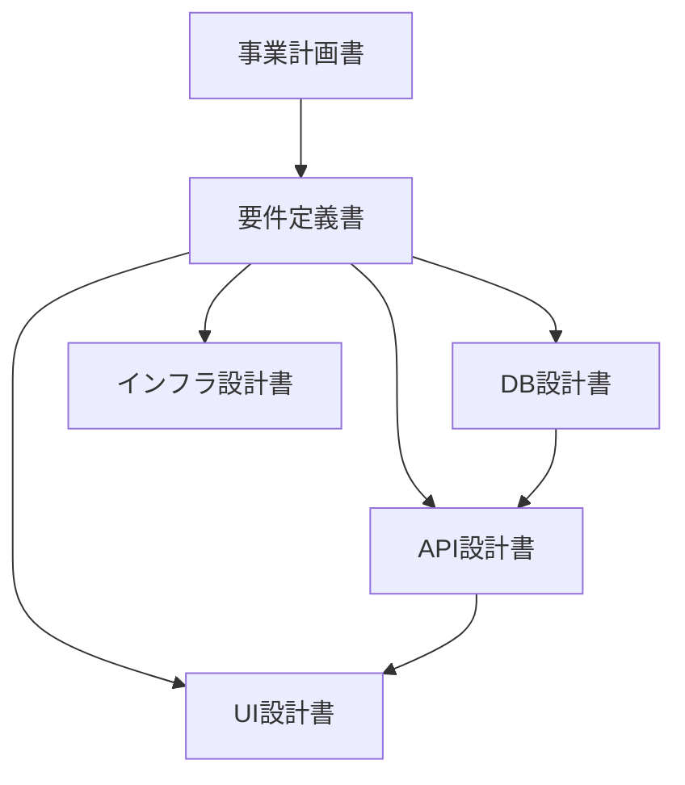

---
hide:
  - navigation
---

# 抽選システム (lottery-system)

抽選システムの設計ドキュメントサイトです。

## ドキュメント一覧

| ドキュメント | 説明 |
|--------------|------|
| [事業計画書](business-plan/index.md) | プロジェクトの背景・目的・ビジネスモデル |
| [要件定義書](requirements/index.md) | USDM形式の機能要件・非機能要件 |
| [DB設計書](database-design/index.md) | テーブル設計・ER図・DBMLスキーマ |
| [API設計書](api-design/index.md) | RESTful API設計・OpenAPI仕様 |
| [UI設計書](ui-design/index.md) | 画面設計・画面遷移・HTMLモックアップ |
| [インフラ設計書](infrastructure-design/index.md) | クラウド構成・CI/CD・セキュリティ |

## ドキュメント依存関係

