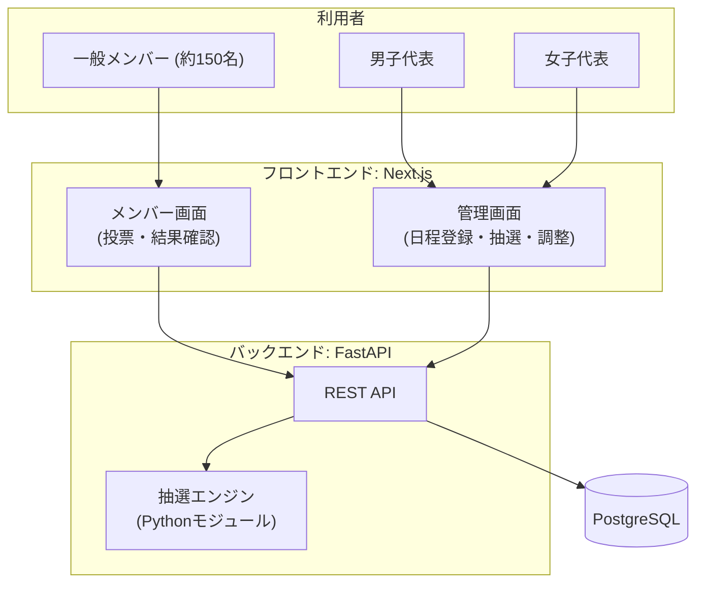

---
hide:
- navigation
doc_type: requirements
version: 2.6.0
last_updated: '2026-08-05'
depends_on:
- business-plan/index.md
derived_by:
- api-design/index.md
- database-design/index.md
- ui-design/index.md
- infrastructure-design/index.md
sync_hash: 2c207f7157b0
dependency_hashes:
  business-plan/index.md: 8aa8f5dc0336
---

# 要件定義書 — サークル練習参加抽選システム

## 1. プロジェクト概要

約150名が在籍する大学バレーボールサークルの練習参加抽選を自動化する Web システム。メンバーは月ごとに参加したい練習日へ投票し、代表がボタン一つで公平な重み付き抽選を実行する。詳細な背景・課題は[事業計画書](../business-plan/index.md)を参照。

## 2. システム概要



### 技術スタック / アーキテクチャ方針

フロントエンドとバックエンドを分離した2サービス構成とする。選定理由: 責務の境界が物理的に分かれることによる開発者の理解のしやすさ、および本プロジェクトの開発ワークフロー（レイヤードAPI開発・マイグレーション・テストの各スキル）との適合を優先する。トレードオフとして2サービスのデプロイ管理と、無料枠利用時のバックエンドのコールドスタート（対策: 定期ping または有料プラン）を受け入れる。

**ホスティング先（インフラ）は未定**。表中のサービス名はあくまで候補であり、インフラ設計書の作成時に確定する。

| レイヤー | 技術 | 補足 |
|----------|------|------|
| フロントエンド | Next.js (App Router) + TypeScript + Tailwind CSS | 画面のみを担当。API はバックエンドを HTTP で呼び出す |
| UI方針 | **全画面モバイルファースト** | メンバー・代表とも利用はスマホ前提。管理画面（抽選実行・微調整・名簿閲覧）もスマホで完結できること |
| バックエンド | Python + FastAPI（レイヤードアーキテクチャ） | router / service / repository の3層構成 |
| 抽選エンジン | 純粋な Python モジュール | API・DB から独立させ、単体でテスト可能にする（シード指定で決定的に動作） |
| データベース | PostgreSQL + SQLAlchemy (ORM) + Alembic (マイグレーション) | JSON型は jsonb を使用 |
| 認証 | メールアドレス + パスワード（JWT Bearer Token） | パスワードは bcrypt でハッシュ化。新規登録時は6桁コードによるメールアドレス確認を必須とする (D-011 / D-012) |
| メール送信 | Resend | 確認コードとパスワードリセットの送信に使用。無料枠3,000通/月 (D-012) |
| インフラ | **未定**（候補: Vercel / Render / Neon 等の無料枠） | インフラ設計書の作成時に確定する |

## 3. 機能要件 (USDM)

### REQ-001: 認証

| ID | 要求 | 理由 | 説明 |
|----|------|------|------|
| REQ-001 | メンバーはメールアドレスとパスワードでシステムにログインできること | 個人情報と投票内容を本人のみが操作できるようにするため | JWT による認証 |
| REQ-001.1 | メールアドレスとパスワードで新規アカウントを登録できること | 約150名のメンバーが自分で登録できる必要があるため | パスワードは8文字以上。bcrypt でハッシュ化して保存。登録直後は「メール未確認」状態とし、REQ-001.5 の確認が完了するまでログインできない (D-011) |
| REQ-001.2 | 登録済みのメールアドレスとパスワードでログインできること | 継続的にシステムを利用するため | ログイン成功時に JWT を発行。メール未確認のアカウントはログインを拒否し、確認コードの入力を促す |
| REQ-001.3 | ログアウトできること | 共用端末での利用も想定されるため | クライアント側でトークンを破棄 |
| REQ-001.4 | パスワードを忘れた場合に再設定できること | パスワード忘れによる利用不能を防ぐため | 登録メールアドレス宛にリセットリンクを送信 |
| REQ-001.5 | 登録したメールアドレス宛に届いた6桁の確認コードを入力して登録を完了できること | メールアドレスの実在性を確認し、他人のアドレスでの登録を防ぐため | コードの有効期限は15分。入力失敗5回でコードを無効化する。コードはハッシュ化して保存し平文では保持しない (D-012)。確認が完了したらそのままログイン状態にする (D-014) |
| REQ-001.6 | 確認コードを再送できること | メールの不達・期限切れで登録を完了できない事態を防ぐため | 再送時は新しいコードを発行し、有効期限と失敗回数をリセットする |
| REQ-001.7 | 新規登録時にパスワードを2回入力し、一致することを確認できること | 打ち間違えたまま登録するとログインできなくなるため | 不一致の場合は送信前に画面上でエラーを表示する (D-014) |

### REQ-002: プロフィール管理

| ID | 要求 | 理由 | 説明 |
|----|------|------|------|
| REQ-002 | メンバーは自分のプロフィールを登録・編集できること | 抽選（学年・性別・マネージャー区分）と連絡（個人情報）に必要なため | 初回ログイン時に登録を必須とする |
| REQ-002.1 | 名前・住所・電話番号・メールアドレス・学年・性別・学部学科・学籍番号・マネージャー区分を登録できること | 抽選条件と代表の連絡・管理に必要な項目であるため | 全項目必須。学年は1〜3年（4年は在籍しない）。性別は男 / 女（抽選グループの決定に使用） |
| REQ-002.2 | 登録済みプロフィールを本人が編集できること | 進級・転居等で情報が変わるため | 学年は年度替わりに各自更新する運用とする |
| REQ-002.3 | 他のメンバーのプロフィール（個人情報）は閲覧できないこと | 個人情報保護のため | 個人情報の閲覧は代表のみ（REQ-007） |

### REQ-003: 練習日程管理（代表）

| ID | 要求 | 理由 | 説明 |
|----|------|------|------|
| REQ-003 | 代表は月ごとの練習日程を登録・管理できること | 投票と抽選の前提となる情報のため | 代表は自分の担当性別の日程のみ管理する |
| REQ-003.1 | 練習日（日付・開始/終了時刻）と練習場所を登録できること | メンバーが投票時に判断する基本情報のため | 月単位でまとめて登録・編集できる |
| REQ-003.2 | 練習ごとの参加定員を設定できること | 施設の収容人数に応じて参加者を制限する必要があるため | 定員は練習日ごとに個別設定可能 |
| REQ-003.3 | 投票の受付期間（開始・締切）を設定できること | 締切後に抽選を実行する運用のため | 締切後は投票の新規・変更を不可とする。指定は**日付のみ**で、開始日の0:00〜締切日の23:59とする (D-014) |
| REQ-003.4 | 登録済みの練習日程を編集・削除できること | 施設都合による変更に対応するため | 抽選実行後の削除は確認ダイアログで警告 |
| REQ-003.5 | 練習の開始・終了時刻は30分単位で指定できること | 分単位の入力は不要で、選択肢が多いと入力の手間になるため | サーバー側でも30分単位であることを検証する (D-014) |
| REQ-003.6 | 過去に登録した練習（場所・開始/終了時刻）を候補として選び、入力を省略できること | 毎月ほぼ同じ体育館・同じ時間帯を登録するため | 担当性別の過去実績を利用回数の多い順に提示する。定員は同じ組み合わせで最後に登録した値を初期値とする (D-014) |
| REQ-003.7 | 登録済みの練習と同じ内容（場所・時刻・定員）で、日付だけ変えて追加できること | 同じ月内で同じ体育館・時間帯の練習が複数回あるため | 複製すると日付のみ空の状態で入力欄が用意される (D-014) |
| REQ-003.8 | 月の練習日程を作成する前に、入力内容を一覧で確認できること | 練習日を複数まとめて登録するため、送信前に誤りに気づけるようにするため | 対象月・投票期間・練習日一覧を日付順に表示し、「修正する」で入力に戻れる。同じ日付が重複している場合は注意を表示する (D-016) |

### REQ-004: 投票

| ID | 要求 | 理由 | 説明 |
|----|------|------|------|
| REQ-004 | メンバーは月ごとに参加したい練習日へ投票できること | 参加希望の収集が抽選の入力となるため | 受付期間内のみ投票可能 |
| REQ-004.1 | その月の練習日一覧（日付・時間・場所・定員）を確認できること | 投票の判断材料のため | 自分の性別グループの練習のみ表示 |
| REQ-004.2 | 複数の練習日を選択して投票できること | 参加したい日をまとめて申告するため | 1日〜全日まで任意の数を選択可能 |
| REQ-004.3 | 締切前であれば投票内容を変更できること | 予定変更に対応するため | 締切後は変更不可 |
| REQ-004.4 | 自分の投票状況を確認できること | 投票済みかどうかを確認できるようにするため | 投票済みの日に印を表示 |

### REQ-005: 抽選

| ID | 要求 | 理由 | 説明 |
|----|------|------|------|
| REQ-005 | 代表は月単位で参加者の抽選を一括実行できること | 手動抽選の作業負荷をなくすことが本システムの目的のため | ボタン一つで担当性別グループの全練習日の抽選を実行 |
| REQ-005.1 | 男子と女子の抽選は完全に独立して実行できること | 男女それぞれに代表がおり、独立して運用されるため | 抽選対象・定員・実行タイミングとも互いに影響しない |
| REQ-005.2 | マネージャーは投票した練習日すべてに定員外で参加できること | マネージャーはプレイヤーではなく練習運営に必要なため | 定員（プレイヤー数）に数えず、抽選対象外で全参加とする |
| REQ-005.3 | 代表は練習日ごとに1年・2年・3年の参加人数を設定できること | 上級生を優先したいが、その度合いは月や日の投票状況によって変わるため | 学年別人数の合計は定員と一致させる。設定するまで抽選は実行できない (D-015) |
| REQ-005.4 | 学年ごとに完全に独立した抽選を行うこと | 1年生の人数が多く、学年をまたいで同じ基準で競わせると上級生が不利になるため | 学年間で投票者が互いの当選確率に影響しない。学年枠で使い切れなかった枠は他学年へ流さず、空席のまま代表に警告する (D-015) |
| REQ-005.5 | 抽選実行前に、練習日ごとの学年別投票状況を確認できること | 参加人数を決める判断材料が必要なため | 日ごとに学年別の投票者数をグラフで表示し、その場で人数を調整・保存できる (D-015) |
| REQ-005.5.1 | 学年別参加人数の初期値をシステムが自動提案すること | 毎回ゼロから入力するのは手間であり、公平性の目安も必要なため | 各学年に投票者数ぶんの枠を月全体で確保したうえで、残枠を3年→2年→1年の順に延べ投票数を上限として配る。代表は自由に上書きできる (D-015) |
| REQ-005.6 | 投票したメンバーは月に最低1回は当選すること | 「投票したのに月0回」の不公平を作らないため | 各学年枠内で最優先に全投票者へ1枠を保証割当する。学年枠内で不足する場合は他学年の余剰枠から救済する |
| REQ-005.7 | 投票数が多いメンバーほど多くの練習に参加できること | 3日投票した人が1日だけ投票した人と同じ参加数では不公平なため | 最低1回保証の後の残枠でのみ、投票数に比例した機会で配分する（保証が常に優先） |
| REQ-005.8 | 月内の当選回数が特定メンバーに偏らないこと | 参加機会の平準化のため | 残枠配分は「当選数÷投票数」が小さいメンバーを優先するラウンド方式とする |
| REQ-005.9 | 過去に落選したメンバーの当選確率が上がること | 連続落選による不満を救済するため | 前月までの落選数に応じた救済係数を抽選の重みに乗算する |
| REQ-005.10 | 投票者が足りず埋まらなかった枠は空席のまま残し、代表に警告すること | 代表が決めた学年別人数をシステムが勝手に変えないため | 「◯年: 投票者が足りず N枠が空席」と警告し、枠の見直しは代表の判断に委ねる (D-015) |
| REQ-005.11 | 抽選の実行履歴（実行日時・実行者・乱数シード・学年別枠・結果）が記録されること | 抽選の公平性を事後検証できるようにするため | 同一シードで結果を再現可能とする。実行時の学年別枠もあわせて記録する (D-015) |
| REQ-005.12 | 抽選の再実行ができること | 誤操作や日程変更時にやり直せるようにするため | 再実行時は前回結果を破棄し、確認ダイアログで警告 |

### REQ-006: 抽選結果

| ID | 要求 | 理由 | 説明 |
|----|------|------|------|
| REQ-006 | 抽選結果を確認できること | 参加日を各自が把握することが運用の前提のため | メンバーと代表で表示範囲が異なる |
| REQ-006.1 | メンバーは自分の当選した練習日（日付・時間・場所）を確認できること | CSV から自分を探す現状の手間をなくすため | カレンダー/リスト形式で自分の参加日を表示 |
| REQ-006.2 | 代表は練習日ごとの参加者一覧を確認できること | 練習運営・出欠管理に必要なため | 練習日別・メンバー別の両方の視点で表示 |
| REQ-006.3 | 代表は抽選結果を手動で微調整できること | 個別事情（怪我・行事等）に対応するため | 参加者の追加・削除・入替が可能。定員超過時は警告 |
| REQ-006.4 | 抽選結果が確定するまでメンバーには結果を非公開にできること | 微調整中の結果が見えると混乱するため | 代表の「公開」操作により全メンバーへ公開 |

### REQ-007: メンバー管理（代表）

| ID | 要求 | 理由 | 説明 |
|----|------|------|------|
| REQ-007 | 代表はメンバーの情報を閲覧・管理できること | 名簿管理・連絡に必要なため | 代表権限でのみアクセス可能 |
| REQ-007.1 | メンバーの個人情報を名簿（一覧表）形式で閲覧できること | 名簿提出・緊急連絡などメンバー情報がまとめて必要になるタイミングがあるため | 全項目（名前・住所・電話番号・メールアドレス・学年・性別・学部学科・学籍番号・マネージャー区分）を1つの表で表示。代表のみアクセス可能。名簿の閲覧・CSV出力は男女全体を対象とする（NFR-002.4 の例外） |
| REQ-007.1.1 | 名簿を学年・マネージャー区分などで絞り込み・並び替え・検索できること | 必要なメンバーだけをすぐ探せるようにするため | 名前・学籍番号での検索、学年での絞り込みに対応 |
| REQ-007.1.2 | 名簿を CSV 形式でエクスポートできること | 大学への名簿提出や外部資料の作成に使うため | 表示中の絞り込み結果をそのままダウンロード |
| REQ-007.2 | メンバーに代表権限を付与・剥奪できること | 代表交代時の引き継ぎのため | 男子代表・女子代表の2ロール。付与は既存代表のみ可能 |
| REQ-007.3 | 退会したメンバーを無効化できること | 卒業・退会者を抽選対象から除外するため | 論理削除（is_deleted）とし、履歴は保持する |

### 抽選アルゴリズム仕様（REQ-005 の詳細）

抽選は性別グループごとに独立して、以下の手順で月単位に実行する。

```
入力: 練習日リスト（各定員 C_d、学年別枠 Q[d][g] ※代表が抽選前に設定）、
      投票（メンバー m × 練習日 d）
重み: w(m) = 落選救済係数(m) = 1 + α × 前月落選数（α は設定値、既定 0.2）
前提: 全練習日の全学年に枠が設定されていること（未設定なら抽選は実行できない）

Phase 0 — マネージャー:
    投票した練習日すべてに参加（定員外・カウントしない）

Phase 1 — 学年ごとに独立した抽選（3年 → 2年 → 1年。互いに影響しない）:
    1-a. 最低1回保証（最優先）: その学年の全投票者に、投票日の中から
         重み付き抽選で1枠を割当。
         空きがない日しか選べない人が出た場合は、先に入っている人を
         別の投票日へ移して席を空ける（最大マッチング）。
         単純な先着順だと、選択肢の少ない人が後回しになったときに
         枠が余っているのに0回になるため (D-017)
    1-b. 残枠配分: その学年の枠が残る限りラウンドを繰り返す
         - 「現在の当選数 ÷ 投票数」が最小のメンバー群を選ぶ（投票数比例・平準化）
         - その中から重み w(m) の重み付き抽選で1名を選び、
           未当選かつ空きのある投票日へ1枠割当

Phase 2 — 同一学年内での救済:
    1-a で保証できなかった投票者を、同じ学年の余り枠で最優先に救済する
    ※ 学年をまたいだ流し込みは行わない（D-015）
    使い切れなかった枠は空席のまま残し、代表に警告する

出力: 練習日ごとの参加者リスト、落選記録（次月の救済係数に反映）、
      乱数シード、使用した学年別枠
```

**枠の自動提案**（REQ-005.5.1・初期値の算出。代表は上書き可能）

```
1. 各学年に「その学年の投票者数」ぶんの枠を月全体で確保する
   → 全員が月に最低1回当選できる裏付け（Phase 1-a と整合）
2. 残枠を 3年 → 2年 → 1年 の順に、その学年の延べ投票数を上限として配る
3. 日ごとには「その学年に残っている月の枠 × 残り日程における投票割合」で割当
   → 月の枠を上限として扱うため、上級生の端数繰り上げで
     下級生の枠が食われて月0回の人が出ることはない
```

**設計根拠**（規模感）: 男子2026年8月の実データで、定員20人 × 6回 = 120枠に対し投票者78名（3年11・2年22・1年45）、延べ投票263。上記の提案では月の枠が 3年34・2年41・1年45 となり、3年は投票した日すべてに当選、1年は45人に45枠で全員が月1回当選できる。

## 4. 非機能要件

### NFR-001: パフォーマンス

| ID | 要求 | 理由 | 説明 |
|----|------|------|------|
| NFR-001.1 | 150名 × 月10練習日規模の抽選が10秒以内に完了すること | 代表がボタン実行後すぐ結果を確認できるようにするため | 非同期実行とし、完了後に結果画面へ反映 |
| NFR-001.2 | 通常画面の応答が2秒以内であること | スマホからのストレスない利用のため | 投票期間中のアクセス集中（150名規模）を想定 |

### NFR-002: セキュリティ

| ID | 要求 | 理由 | 説明 |
|----|------|------|------|
| NFR-002.1 | 通信はすべて HTTPS で暗号化すること | 個人情報（住所・電話番号等）を扱うため | — |
| NFR-002.2 | パスワードはハッシュ化（bcrypt）して保存すること | 漏洩時の被害を最小化するため | 平文保存の禁止 |
| NFR-002.3 | 個人情報の閲覧は代表権限のみに制限すること | メンバー間の個人情報漏洩を防ぐため | API レベルでロールベースアクセス制御（RBAC） |
| NFR-002.4 | 代表の操作系機能（日程登録・抽選実行・結果微調整）は自分の担当性別グループに限定すること | 男女独立運用の徹底のため | 例外として名簿の閲覧・CSV出力（REQ-007.1）は男女全体を対象とする（サークル全体の名簿提出・緊急連絡のため） |

### NFR-003: 可用性

| ID | 要求 | 理由 | 説明 |
|----|------|------|------|
| NFR-003.1 | 投票期間・結果公開直後の利用に耐えること | 利用が特定期間に集中する特性のため | 月次利用のため 24/365 の高可用性は要求しない |
| NFR-003.2 | データベースの定期バックアップを行うこと | 投票・抽選履歴の消失を防ぐため | クラウドサービスの自動バックアップを利用 |

### NFR-004: 拡張性

| ID | 要求 | 理由 | 説明 |
|----|------|------|------|
| NFR-004.1 | 抽選アルゴリズムの設定値（落選救済係数α・学年枠比率）を管理画面から変更できること | サークルの方針変更に柔軟に対応するため | コード変更なしで代表が変更可能。枠比率は毎月の抽選実行前に設定（REQ-005.5） |
| NFR-004.2 | 将来の他サークル展開を阻害しない設計とすること | 事業計画の横展開余地を残すため | サークル固有値のハードコードを避ける |

## 5. 設計判断の記録 (Decision Log)

なぜその仕様にしたのかの経緯を残す。**仕様の決定・変更時は必ずここに背景を追記すること。**

### D-001: 抽選は「学年係数の重み付け」ではなく「枠方式」を採用

- **決定**: 3年生は全通し、1・2年は残枠を学年別の枠に分割して各学年内で独立抽選する（※ **D-015 により変更**。3年生の全通しは廃止し、枠は日ごと・学年ごとに代表が決める。学年内で独立抽選する点は維持）
- **背景**: 初期案は学年係数（1年=1.0, 2年=1.2, ...）を重みに乗算する確率的な優遇だった。ユーザー（代表）から「3年は投票日全部行けるくらいにしたい」「1年生の人数が本当に多いので、1・2年を同じ基準で競わせるのは違う」という提案があり議論。枠方式は (1) 2年生が1年の物量に押し潰されるのを構造的に防げる、(2) 「1年の枠は◯人だから」と落選理由を即答でき納得感が高い、という点で係数方式より優れると判断
- **却下した代替案**: 学年係数方式 — 「なんで俺落ちたの？」に確率でしか答えられず、説明可能性で劣る

### D-002: 3年生全通しの定員超過ガード

- **決定**: 3年生だけで定員を超過した日は3年内で抽選し、代表に警告を表示する（※ **D-015 により失効**。3年生の全通し自体を廃止したため、このガードは不要になった）
- **背景**: 「100%通し」は3年の投票が定員を超えた瞬間にルール自体が破綻する。実際の規模（3年約10人 < 定員約30人）ではほぼ発動しないが、保険として仕様に残した

### D-003: マネージャーは定員外

- **決定**: マネージャーはプレイヤーではないため定員にカウントせず、投票日すべてに参加する
- **背景**: 当初は「定員内で優先当選」だったが、代表から「マネージャーはそもそもプレイヤーじゃないから人数に換算しなくていい」と指摘され、抽選対象からも定員からも外す設計に変更。抽選ロジックも単純になった

### D-004: 学年枠比率は毎月代表が手動設定

- **決定**: 1年枠・2年枠の比率は固定値にせず、代表が抽選実行前に毎月設定する（前月値を初期表示、1人あたり当選期待値を参考表示）（※ **D-015 により変更**。月単位の比率ではなく、練習日ごとに1〜3年の人数を設定する方式へ。「システムが決めず代表が判断する」という方針自体は引き継いでいる）
- **背景**: 比率の決め方は「人数比例」「固定比率」等の選択肢があったが、何%が適正かは学年構成や月の状況で変わる政治的な判断であり、システムが決めるべきでないと整理。代わりに判断材料（期待値シミュレーション）をシステムが提供する
- **却下した代替案**: 人数比例の自動計算 — 1人あたり当選期待値が学年間で同じになり「学年が上ほど優先」の方針と矛盾する

### D-005: 最低1回保証 > 投票数比例 の優先順位

- **決定**: 「投票したのに月0回」を作らない保証が常に最優先。投票数比例は保証後の残枠でのみ効く
- **背景**: 1年の人数が多い月は保証と比例が両立できない可能性がある。「公平性の最低ラインは全員に保証し、その上の贅沢分で差をつける」方が炎上しにくいと判断。規模試算（150枠 ÷ 60人 ≒ 1.6回/月）で両立可能なことも確認済み

### D-006: 枠の余りは他学年へ流し込む

- **決定**: 学年枠で使い切れなかった枠は他学年の落選者に配分する（※ **D-015 により変更**。代表が日ごとに決めた人数を勝手に変えないため、学年をまたいだ流し込みは行わず、空席のまま警告する）
- **背景**: 枠を固定したままだと「1年に落選者がいるのに空席のまま練習する」ことが起こる。%固定枠方式の構造的な弱点への対処として明文化

### D-007: 技術スタックは Next.js + FastAPI の分離構成

- **決定**: フロントエンド (Next.js/Vercel) とバックエンド (FastAPI/Render等) を分離した2サービス構成（※根拠の一部を D-010 で訂正）
- **背景**: 検討は3転した。(1) 当初 FastAPI 分離構成 → (2) 「150名規模・月次利用では2サービスの運用コスト（デプロイ2箇所・無料枠のコールドスタート・型定義の二重管理）が利点を上回る」として Next.js フルスタック一本に変更 → (3) 開発者本人から「フロントとバックエンドが物理的に分かれている方が理解しやすい」との判断で分離構成に最終決定。**作る本人が理解・保守できることを理論上の最適より優先した**
- **トレードオフとして受け入れたもの**: バックエンド無料枠のコールドスタート（対策: 定期ping または有料プラン）、2言語の保守
- **補足**: 抽選アルゴリズムの計算速度は選定理由にならない（どの言語でも数ミリ秒。ボトルネックは常にDB・ネットワーク・コールドスタート）

### D-010: skills の Hono.js 前提が判明した後も FastAPI を維持

- **決定**: バックエンドは FastAPI (Python) のまま変更しない。backend 系 skills（Hono.js + Drizzle + Vitest 前提）は本プロジェクトでは使用せず、その構成方針（レイヤード・Docker Compose・テスト駆動）のみ踏襲して手動構築する
- **背景**: D-007 で FastAPI を選んだ根拠の一つ「プロジェクトの skills が Python 前提」は誤認だった（実際は全 backend skills が Hono.js/TypeScript 前提）。実装開始時にこれが判明し、skills をそのまま使える Hono.js への変更も提案したが、開発者の判断で FastAPI を維持
- **却下した代替案**: Hono.js + TypeScript への変更 — skills の実装自動化をフルに使え1言語で完結するが、採用しなかった
- **受け入れたトレードオフ**: backend 系 skills（init / api-develop / db-migrate / test / seed）の自動化が使えず、FastAPI 版を手動で構築する

### D-008: 名簿の閲覧は男女全体（NFR-002.4 の例外）

- **決定**: 代表の操作系（日程・抽選・微調整）は担当性別に限定するが、名簿の閲覧・CSV出力は男女全体を対象とする
- **背景**: 個人情報を取得する目的が「名簿提出・緊急連絡などメンバー情報がまとめて必要になるタイミングがある」ことだったため。サークル全体の名簿が必要なユースケースに対し、閲覧だけ例外を認めても抽選運用の男女独立性は操作権限の分離で守れると判断

### D-009: 全画面モバイルファースト

- **決定**: メンバー画面だけでなく代表用の管理画面もスマホで完結できるように設計する
- **背景**: 当初はメンバー=スマホ、管理画面=PC想定だったが、代表もスマホで使うことが判明。抽選実行・微調整・名簿閲覧までスマホ前提に変更

### D-011: 新規登録はメールアドレス確認つきの自由登録とする

- **決定**: 誰でも登録フォームからアカウントを作成できる。ただし登録直後は「メール未確認」状態とし、登録したメールアドレス宛に届いた確認トークンを検証するまでログイン・投票を行えない
- **背景**: 認証方式の検討時に、(A) メール確認つき自由登録 / (B) 代表による招待制 / (C) 名簿事前登録＋初回パスワード設定 の3案を比較した。アシスタントからは、既に `import_members.py` で Excel 名簿を取り込む仕組みがあり代表が参加者を管理する運用実態があることから C を推奨したが、開発者の判断で A を採用。登録の入口を代表が握らないため、新入部員が増えても代表の作業が発生しない点を優先した
- **却下した代替案**: B（招待制）— 登録できる人をサークル関係者に限定できるが、代表が都度招待を送る運用負荷が発生する。C（名簿事前登録）— 現状の実装からの移行は最も楽だが、同じく代表の名簿更新が前提になる
- **受け入れたトレードオフ**: サークル外の人物でも、実在するメールアドレスさえ持っていれば登録できてしまう。メール確認はアドレスの実在性を保証するだけで、サークル所属の証明にはならない。不正なアカウントが混入した場合は、代表が事後に無効化・削除する運用で対処する
- **前提となる未決事項**: メール送信基盤（現状 `auth_service.request_password_reset` は送信せずサーバーログにトークンを出力する TODO 状態）の選定が必要。確認トークンはパスワードリセットと同じ基盤を共用する → D-012 で決定

### D-012: メール確認は6桁コード方式・Resend 送信・有効期限15分

- **決定**: D-011 のメールアドレス確認について、次の3点を確定する
    - **確認方式**: 6桁数字のコードをメールで送り、画面に入力させる（リンククリック方式は採用しない）
    - **メール送信サービス**: Resend を使用する。パスワードリセットのメール送信も同じ基盤に統一する
    - **有効期限・試行制限**: コードの有効期限は15分。入力失敗5回でコードを無効化し、再送で新しいコードを発行する。未確認アカウント自体は削除しない
- **背景**: D-009 で全画面モバイルファーストと決めており、スマホでメールアプリとブラウザを往復させるリンク方式より、コードを画面に入力する方式のほうが体験が良いと判断した。送信サービスは Resend / SendGrid / Amazon SES / Gmail SMTP を比較し、独自ドメインなしで即利用でき（`onboarding@resend.dev`）、API が単純で、無料枠3,000通/月が150名・月次利用に対し十分に余裕があることから Resend を選定した。有効期限は、6桁コードが100万通りしかなく期限が長いほど総当たりの猶予を与えるため、リンク方式の一般値24時間ではなく15分とした
- **却下した代替案**: リンク方式 — 実装は簡単だが、モバイルでのアプリ間往復が発生する。SendGrid — 実績は豊富だがアカウント審査が厳しい。Amazon SES — 最安だが初期にサンドボックス解除申請が必要。Gmail SMTP — 設定は容易だが本番運用に非推奨
- **設計上の帰結**: コード方式は JWT でトークンを表現できない（6桁に収まらない）ため、コードをサーバー側に保存して照合する必要がある。`users` に `email_verified_at` / `verification_code_hash` / `verification_expires_at` / `verification_attempts` を追加する。コードはパスワード同様ハッシュ化して保存し、平文では保持しない
- **受け入れたトレードオフ**: 未確認アカウントを削除しないため、確認せず放置されたレコードが蓄積する。150名規模では実害が小さく、削除バッチの実装コストのほうが高いと判断した

### D-013: 日時は DB・API とも timestamptz / オフセット付き ISO 8601 に統一

- **決定**: 全テーブルの日時カラムを `timestamp without time zone` から **`timestamptz`** に移行し、Python 側も aware な UTC の `datetime` で扱う。API レスポンスの日時は必ずオフセット付き（`2026-08-01T10:53:15.860494Z`）で返す
- **背景**: D-012 の実装中に、DB設計書は `timestamptz` と記載しているのに実装は `timestamp`（タイムゾーンなし）で、設計書と実装が乖離していることが判明した。調査したところ表記の不一致にとどまらず、**フロントエンドで日時が9時間ずれる不具合**を引き起こしていた。API がオフセットなしの文字列（`2026-08-01T10:53:15`）を返し、JavaScript の `new Date()` がこれをローカル時刻（JST）として解釈するため。影響箇所は投票締切の表示と、`isVoteStarted` / `isVoteEnded` による締切判定（締切前なのに「締切済み」と表示されうる）
- **却下した代替案**: naive UTC のまま API 出力にだけ `Z` を付与する案 — 変更は小さいが、DB設計書を実装に合わせて `timestamp` へ書き換える必要があり、「naive だが実は UTC」という暗黙の前提が残る。投票締切という時刻の正確さが要る機能を扱う以上、DB の型で表明すべきと判断した
- **移行方法**: `ALTER COLUMN ... TYPE timestamptz USING <col> AT TIME ZONE 'UTC'` で21カラムを変換。`USING` を明示したのは、省略するとセッションの `TimeZone` 設定が使われ、UTC 以外の環境でマイグレーションを流したときに時刻がずれるため（開発環境の DB は `Etc/UTC`）
- **付随して整理したもの**: `src/core/security.py` に重複して定義していた `utcnow()` を削除し、`src/core/datetime_utils.py` のものに一本化。同モジュールの `to_naive_utc()` は `to_utc()` に改名（naive 化ではなく UTC 正規化を行う関数になったため）

### D-014: 登録・日程入力の操作性改善（5点）

- **決定**: 実際の名簿でテストした際に出た使いにくさへの対処として、以下5点を実装する
    1. **パスワードの2度入力** — 新規登録画面に確認欄を設け、不一致ならフロント側で送信前にエラー表示する（API は変更なし）
    2. **確認コード入力後にそのままログイン** — `POST /auth/verify` を 204 から**アクセストークンを返す 200** に変更し、確認完了と同時にログイン状態にする
    3. **投票期間は日付のみ指定** — 時刻の入力をやめ、開始日の 0:00 〜 締切日の 23:59 に固定する
    4. **練習日の履歴からの入力** — 過去に登録した「場所 + 開始/終了時刻」の組み合わせを候補として提示し、選ぶと自動入力する（`GET /practices/suggestions`）
    5. **練習時刻は30分単位** — 開始・終了時刻の入力を30分刻みに制限する（サーバー側でも検証する）
    6. **同じ内容で別日を追加** — 登録済み・入力中の練習を複製し、日付だけ空にして追加できるようにする（4 は過去の月からの流用、6 は同じ月内での繰り返しを想定）
- **背景**: 165名の実データを投入して代表の運用を試したところ、毎月ほぼ同じ体育館・同じ時間帯を登録するのに毎回すべて手入力する必要があり、投票期間も分単位で指定させられていた。抽選運用は月1回の定型作業のため、入力の自由度より手数の少なさを優先する
- **各決定の理由**:
    - **2** について: フロントに登録時のパスワードを保持させて確認後に自動ログインする案もあったが、パスワードを画面遷移をまたいで持ち回ることになるため却下した。トークンを返す方式なら、ログイン画面で 403 `EMAIL_NOT_VERIFIED` を受けて確認画面へ来た場合にも同じ挙動になる。なお API 設計ルール「POST の 200 response は基本未定義」の例外にあたるが、`POST /auth/login` と同じくトークン返却が目的のため必要と判断した
    - **3** について: 締切日を丸一日投票可能にするため 23:59 とした。「締切は夜21時に固定」案もあったが、締切時刻を運用で変えたくなる可能性があり、日付の意味が直感的な 23:59 を選んだ
    - **4** について: 候補は「場所 + 開始/終了時刻」でまとめる。**定員はグルーピングに使わない** — 施設の空き状況で毎月変わるため、定員まで含めると同じ体育館・同じ時刻の候補が定員違いで重複してしまう。定員は同じ組み合わせの中で最後に登録した値を初期値として返す
    - **5** について: 15分単位案もあったが、実際の練習は 18:00 / 18:30 開始しかないため30分で十分と判断した
    - **6** について: 4（履歴からの候補）と機能が重なるが、用途が違うため両方用意する。4 は過去の月から流用する導線（プルダウン）、6 は同じ月内で同じ練習が複数回あるときの導線（複製ボタン）。複製時は**日付だけ空にする** — 日付まで引き継ぐと同じ日を二重登録する誤りを誘発するため
- **受け入れたトレードオフ**: 3 により、投票締切を「20日の18時」のように時刻指定することはできなくなる。5 により 18:15 開始のような練習は登録できない。いずれも現在の運用では発生しないが、必要になれば D-XXX を追加して見直す

### D-015: 3年生の全通しを廃止し、日ごと・学年ごとに代表が参加人数を決める方式へ

- **決定**: 抽選の枠の決め方を次のように変更する
    1. **3年生の全通しを廃止** — 3年生も枠を超えれば落選する（D-001 / D-003 を変更）
    2. **月単位の学年枠比率（2年:1年）を廃止** — 代わりに**練習日ごとに1年・2年・3年の参加人数**を代表が決める（D-004 を変更）
    3. 抽選前に**日ごとの学年別投票状況を確認する画面**を設け、そこで人数を調整してから抽選を実行する
    4. 学年別人数の**合計は定員と一致**させる（一致しないと保存できない）
    5. 人数の**初期値はシステムが投票状況から自動提案**する（代表は自由に上書きできる）
    6. 学年内の公平ルール（月に最低1回保証・投票数比例・落選救済 α）は**すべて維持**する
- **背景**: 実際の名簿（男子77名・女子87名）を入れて運用を試したところ、「3年生は無条件で全通し」という固定ルールが実態と合わないことが判明した。開発者の要望は「3年生はなるべく入れたいが、どうしても3年を除かないと1年生が回らない（公平でない）ときは除きたい」「2年生も3年ほどではないが同様に優先したい」というもので、**優先度の強弱を月ごと・日ごとに調整したい**という性質のものだった。固定ルールでは表現できないため、代表の判断を入れられる形に変えた
- **却下した代替案**: 学年ごとに重み係数を設定して自動配分する案 — 設定は一度で済むが、「今月は1年が多いから3年を少し削る」といった月ごとの機微を表現できない
- **枠の自動提案の算出方法**: 比率を固定せず、投票状況から毎月導く
    1. 各学年に「その学年の投票者数」ぶんの枠を月全体で確保する（全員が月1回当選できる裏付け。REQ-005.6 と同じ考え方）
    2. 残枠を 3年 → 2年 → 1年 の順に、その学年の**延べ投票数**を上限として配る
    3. 日ごとには「その学年に残っている月の枠 × 残り日程における投票割合」で割り当てる。**月の枠を上限として扱う**ことで、上級生の端数繰り上げによって下級生の枠が食われ月0回の人が出ることを防ぐ
    - 例（男子2026年8月・総枠120）: 投票者 3年11・2年22・1年45 / 延べ投票 34・64・165 → 月の枠 **3年34・2年41・1年45**。3年は全日で投票者全員が入り、1年は45人に45枠で全員が月1回当選できる
- **学年をまたいだ余剰枠の流し込みを廃止** (D-006 を変更): 代表が日ごとに決めた学年別人数をシステムが勝手に変えないため、投票者が足りず埋まらない枠は**空席のまま残し、警告を出す**
- **受け入れたトレードオフ**:
    - 代表の作業が1手順増える（枠の確認・保存をしてからでないと抽選できない）。ただし初期値が自動で入るため、そのまま保存するだけでも運用できる
    - 総枠が全学年の投票者数を下回る月は、優先度順に確保されるため下級生の枠が0になりうる。150名規模・総枠120に対し投票者78名という現状では発生しないが、発生時は代表が手で調整する
    - 抽選の再現に必要な情報が `lottery_executions.grade2_ratio` から `settings_snapshot.quotas` へ移った。過去の実行履歴は `grade2_ratio` を保持したまま残す（列は NULL 許容に変更）

### D-016: 月の練習日程は確認画面を挟んでから作成する

- **決定**: 「新しい月を作成」で入力した内容は、送信前に確認画面で一覧表示する。対象月・投票期間・練習日（日付順）を表示し、「修正する」で入力画面に戻れる。同じ日付の練習が複数あるときは注意書きを出す
- **背景**: 月の作成では練習日を5〜6件まとめて入力するうえ、D-014 で「同じ内容で別日を追加」（複製）を入れたため、日付の入れ忘れや同じ日の二重登録が起こりやすくなった。作成後に個別修正はできるが、まとめて見直せる場所がないと気づけない
- **適用範囲**: 月の新規作成のみ。既存月への練習日の追加・編集は1件ずつの操作で内容が画面に見えているため、確認画面は挟まない
- **却下した代替案**: `window.confirm` による確認ダイアログ — 実装は簡単だが、練習日の一覧を読める形で出せない

### D-017: 最低1回保証は席の入れ替えを行い、保証できる人数を最大化する

- **決定**: 最低1回保証（REQ-005.6）の割当で、空きのある投票日がない人が出た場合は、**先にその日に入っている人を別の投票日へ移して席を空ける**（二部グラフの最大マッチング）。移せる人がいない場合のみ保証失敗とし、警告を出す
- **背景**: 実データ（男子2026年8月・1年の投票者45人 / 1年枠の合計45）で抽選したところ、**枠は足りているのに4人が月0回**になった。原因は割当順で、重み付きのランダム順に「空いている日」へ入れるだけだったため、投票日が1〜2日しかない人が後回しになるとその日が先に埋まってしまっていた。別途マッチングを解いて確認したところ、45人全員に配れる割り当てが存在していた（＝アルゴリズムの取りこぼし）
- **効果**: 同じデータ・20シードで検証し、0回の人が **4人前後 → 0人** になった
- **維持したもの**: 誰がどの日に入るかは従来どおり乱数（落選救済の重み付き）で決まる。シード固定で再現できる性質も保つ
- **保証が本当に不可能な場合**: 投票日がすべて満員で移動先もない場合のみ「最低1回保証を満たせませんでした」と警告する。この警告が出たときは、枠の配分自体を見直す必要があることを意味する

### D-018: 抽選の実行履歴は記録するが画面には表示しない

- **決定**: 抽選実行画面から実行履歴の一覧表示を削除する。**記録（`lottery_executions`）と取得API（`GET /practice-months/{pmId}/executions`）は残す**
- **背景**: REQ-005.11 が求めているのは「事後検証できるよう記録されること」であり、代表が日常的に読む情報ではない。実際に画面へ出したところ、ULID のユーザーID・乱数シード・過去実行の警告が縦に積み上がり、**本来の作業（参加人数の調整と抽選実行）を押し下げていた**
- **代替**: 抽選直後は結果カードに**その回の警告だけ**を表示する。代表が対応すべき警告（保証を満たせなかった／枠が空席のまま）はここで確認できる
- **受け入れたトレードオフ**: 過去の抽選のシードや警告を画面から見られなくなる。事後検証が必要になった場合は API または DB を直接参照する。必要が生じたら専用画面として作り直す

### D-019: 代表ヒアリングで判明した運用実態と、抽選まわりの変更方針（実装は保留）

2026年8月の代表との打ち合わせで、これまでの想定と異なる運用実態および新たな要望が判明した。いずれも抽選の前提に関わるため、**本記録は方針の確定のみを行い、実装は後日着手する**。ログイン・登録まわりの変更は D-020 以降で別途扱う。

#### (1) 定員は「各学年10人・合計30人」が基本

- **決定**: 学年別参加人数（REQ-005.3）の初期値を **1年10・2年10・3年10** とする
- **背景**: これまで「上級生をどれだけ優先するか」を月ごとに判断する前提で設計していた（D-015）が、実際の運用ではすでに**各学年10人ずつで固定的に回している**ことが判明した。学年別に人数を決める仕組み自体（D-015）はこの運用と合致しており、枠組みの変更は不要
- **影響**: REQ-005.5.1 の自動提案ロジック（月全体の投票数から按分する方式）は前提を失う。10/10/10 を既定値とし、代表が必要に応じて上書きする形に簡素化する
- **未決事項**: ある学年の投票者が10人未満だった場合に、**余った枠を他学年へ回すか**。回さない場合は D-015（学年をまたいだ流し込みは行わない）を維持し空席のままとなる

#### (2) 特定の練習日を特定の学年に限定したい

- **決定**: 練習日ごとに「対象学年」を指定できるようにする。対象外の学年は**投票画面にその日を表示しない**
- **背景**: 「この日は3年生だけ」「この日は1年生の練習」といった日が実際に存在する
- **実現方式**: 抽選ロジックの変更は不要で、対象外学年の枠を 0 にすれば成立する。ただし枠0だけでは**参加できない日に投票できてしまう**ため、練習日側に対象学年の属性を持たせ、投票画面でフィルタする。データモデルとUIの改修のみで完結する

#### (3) 2〜3人をセットで参加させたい（グループ制約）

- **決定**: 複数メンバーを1単位として「全員当選か、全員落選か」となるグループ機能を追加する。**実装方式は既存の抽選エンジンの前段（Phase 0）として実装する**
- **背景**: 特定の2〜3人を必ず同じ日に参加させたいケースがあると判明した
- **技術的な影響**: 本変更が最も重い。現行エンジンは「1人＝1席」を前提としており、次の3点が崩れる
    1. **不可分な単位ができる** — 枠が2つ空いていても3人組は入れられない
    2. **学年をまたぐ** — 1年2人＋2年1人のグループは複数の学年枠を同時に消費する
    3. **最低1回保証（D-017）のマッチングが解けない** — 二部グラフの各ノードが可変サイズになり、単純な最大マッチングでは扱えなくなる
- **採用する方式**: グループを先に配置し、**残った枠に対して既存の Phase 1（最低1回保証）・Phase 2（重み付き抽選）をそのまま適用する**2段構え

    ```
    Phase 0: グループ配置（新規）
      ├ グループ全員が投票している日のみを候補とする
      └ 確定したら各学年枠から人数ぶんを減算する
    Phase 1: 最低1回保証（既存・残枠に対して実行）
    Phase 2: 残枠の重み付き抽選（既存）
    ```

- **理由**: この順序であれば Phase 1・2 のコードにほぼ手を入れずに済む。グループが枠を食い潰す事態は起こりうるが、その調整は代表の判断（枠の見直し）に委ねる
- **未決事項**: グループが**恒久的なもの**（常に一緒の3人組）か、**月ごと・日ごとに代表が指定するもの**か。前者ならマスタデータ、後者なら月別練習に紐づくデータとなり、データモデルが変わる

#### (4) 前月に不遇だったメンバーを翌月に優遇する

- **決定**: 「投票数が多かったのに参加できなかった人」を翌月に優遇する仕組みを設ける
- **背景**: 代表から明示的な要望として挙がった
- **既存機能との関係**: 落選救済係数 α（REQ-005.7）が同じ思想で実装済みであり、その強化で対応できる可能性が高い
- **未決事項**: 「免除」の意味が2通りに解釈でき、確定していない
    - (a) 翌月の抽選で**優先的に当選**させる → 既存の α の延長で対応可能
    - (b) 翌月は**月あたりの参加上限のカウントから外す**（上限を超えて参加できる）→ 新規の仕組みが必要
    - 現行システムは (a) の思想で作られている。代表への再確認が必要

#### 着手順の方針

| 順 | 内容 | 理由 |
|----|------|------|
| 1 | (1) 枠の既定値、(2) 学年限定日 | 影響範囲が小さく、既存の枠組みに乗る |
| 2 | (4) 前月の不遇者の優遇 | 意味を確定してから既存 α を拡張 |
| 3 | (3) グループ制約 | 設計を固めてから着手。エンジンへの影響が最大 |

### D-020: メンバー側のログインを廃止し、名簿から本人を選んで投票する方式へ

> ※ **D-021 により変更**。本人の識別は LINE ログインで行う方式へ移行した。ただし「メールアドレス＋パスワードによる自由登録とメール確認を廃止する」「代表のみ従来のログインを維持する」という骨子は D-021 に引き継がれている。以下は、その判断に至るまでの検討経緯として残す

- **決定**: 認証の構成を次の非対称な形に変更する
    - **メンバー側: ログインなし**。投票画面で名簿から自分を選び、参加したい練習日を提出する（「調整さん」に近い形式）
    - **代表側: ログインあり**。抽選実行・枠設定・日程管理・結果公開は従来どおりメールアドレス＋パスワードで認証する（対象は男子代表・女子代表の2名のみ）
- **背景**: 個人情報（氏名・学年・連絡先）の収集はすでに Google フォームで完結しており、本システムが個人情報の入口を兼ねる必要がなくなった。認証に残る役割は「投票してきたのが誰かを識別すること」だけになる
- **決め手となった運用上の理由**:
    1. 投票URLは **LINE で共有する**予定であり、多くの利用者はブラウザにセッションが残っていない状態でサイトを開く。毎回ログインを求めると投票のハードルが上がる
    2. 新歓期には体験参加者が多数訪れるが、ログイン制にすると**入会しなかった人のアカウントまで作られ、後の削除が代表の負担になる**
- **却下した代替案**:
    - **Google ログイン (OAuth)**: パスワード管理が不要になり名簿との突合も容易だが、上記の「体験者のアカウントが残る」問題を解決できない
    - **投票時に「体験 / 入会済み」を選ばせ、入会済みのみ Google ログインへ進ませる**: 実装コストが上がるわりに、得られるのは既存メンバーの入力の手間が省ける点のみ。上記1の理由（キャッシュが残っていない利用者が大半）から、その利点も薄いと判断した
- **名前の指定方法**: 自由入力は採用せず、**名簿からのサジェスト選択**とする。自由入力では次の3点が壊れるため
    1. **表記ゆれ** — 「丸山　亮也」（全角スペース）と「丸山亮也」が別人として扱われる
    2. **同姓同名** — 150名規模では現実に起こりうる。候補には学年を併記して区別する
    3. **履歴の断絶** — 落選救済 (REQ-005.7) と最低1回保証 (REQ-005.6) は同一人物の過去の記録を前提としており、紐付けが一度でも外れると履歴が失われる
- **受け入れたリスク（性善説の採用）**: 本人確認を行わないため、他人の名前で投票して**その人を勝手に当選・落選させる**ことが技術的には可能になる。ただしサークル内部の利用に限られ、結果は全員に見える形で公開されるため発覚しやすい。この規模と用途では許容できると判断した
- **副次的な変更**: 「自分の結果をログインして確認する」(REQ-006.1) が成立しなくなるため、**抽選結果は全員分を一覧で公開する**形に変更する。運用としては公開URLを LINE に貼るだけで済むため、むしろ簡素になる
- **受け入れたトレードオフ**: 結果ページはURLを知っていれば誰でも閲覧できるため、**氏名と学年の一覧が認証なしで参照可能**になる。連絡先等は本システムに保持しないため影響範囲は限定的と判断した
- **スコープ外（今回は考慮しない）**: 新歓期の体験参加者の扱い。体験者は学年上ほぼ1年生であり通常メンバーと同列に混ぜる想定だが、新歓期は投票者数が通常月と大きく異なり、最低1回保証が成立しなくなる・早い者勝ちの要素が必要になる等、通常運用とは前提が異なる。**当面は「入会済みのメンバーのみが投票する」前提で設計する**
- **廃止するもの**: 新規登録 (REQ-001.1)、メールアドレス確認 (REQ-001.5〜1.7 / D-011 / D-012 / D-014)、メンバー自身によるプロフィール更新 (REQ-002.2)。名簿の登録・更新は代表がフォームの結果を取り込む形に一本化する
- **維持するもの**: 代表用のログイン・パスワードリセット、性別スコープによるアクセス制御 (NFR-002.4)、抽選アルゴリズム一式
- **要件本文の改訂**: REQ-001 / REQ-002 / REQ-006.1 / REQ-007 の改訂は、実装着手時にまとめて行う

### D-021: メンバーの本人識別は LINE ログインで行う

- **決定**: メンバー側の認証を **LINE ログイン**とする。投票URLを LINE で開くと LINE アカウントで本人が特定され、パスワードの入力も名前の申告も不要になる。代表側は従来どおりメールアドレス＋パスワードでログインする（D-020 の非対称構成は維持）
- **背景**: D-020 では「ログインを一切なくし、名簿から本人を選ぶ」方式を採ったが、検討の過程で次の問題が順に表面化した
    1. 名簿からの選択方式は、代表がフォームの回答を取り込んで名簿を維持し続ける運用を前提とする
    2. 名前の自由入力に切り替えると、表記ゆれ・同姓同名により**落選救済 (REQ-005.7) と最低1回保証 (REQ-005.6) の履歴が繋がらなくなる**
    3. いずれの方式でも、なりすまし（他人の名前で投票し、その人を当選・落選させる）を防げない
- **決め手**: 投票URLは LINE で共有するため、**LINE アプリ内ブラウザで開かれる**。この環境では LINE 側のログイン状態をそのまま利用できるため、**認証を導入しても利用者の手間が増えない**。D-020 でログイン廃止を選んだ最大の理由（毎回ログインさせると投票のハードルが上がる）が、この方式では成立しない
- **解消される問題**:
    - 識別子が LINE のユーザーIDになるため、**表記ゆれ・同姓同名の問題が消える**。過去の投票・当選履歴が確実に同一人物へ紐づく
    - 本人以外は投票できないため、**D-020 で受け入れたなりすましリスクが不要になる**
    - 名簿の事前登録が不要になり、代表のインポート運用がなくなる
- **利用者の体験**:
    - **初回のみ**: LINE の認可画面 → 本名・学年・性別を登録する画面 → 投票画面
    - **2回目以降**: URLを開くと直接投票画面（登録内容はユーザーIDで引き当てる）
- **LINE から取得できない情報**: LINE のプロフィールから得られるのは表示名とアイコンのみで、**本名・学年・性別は取得できない**。表示名はニックネームであることが多く代表が結果を確認する際に判別できないため、初回登録時に本名・学年・性別を入力させる
- **結果の通知**: LINE 公式アカウント（Messaging API）から**抽選結果を個別にプッシュ通知**できる。制約事項の「通知はスコープ外」を見直す余地が生まれるが、無料枠に送信通数の上限があるため導入可否は別途判断する。**LINE ログインのみでも成立する**ため、通知は後追いでよい
- **結果の公開方法**: 本人が特定できるため、D-020 の「全員分を一覧公開」は不要となり、REQ-006.1（自分の当選結果を確認できる）を維持できる。認証なしで氏名一覧が閲覧可能になるという D-020 のトレードオフも解消される
- **前提条件（未確定）**:
    1. サークルの **LINE 公式アカウントの開設**（LINE Developers での登録）が必要
    2. LINE ログインは **公開された HTTPS のURLを必須**とするため、**本番環境へのデプロイが前提**になる。ローカル環境だけでは動作確認できない
- **スコープ外**: 新歓期の体験参加者の扱い（D-020 と同じ）

## 6. 用語集

| 用語 | 定義 |
|------|------|
| メンバー | サークルに在籍しシステムに登録した利用者 |
| 代表 | 抽選実行・日程管理・個人情報閲覧の権限を持つ管理者。男子代表・女子代表の2名 |
| マネージャー | 練習運営を担う非プレイヤーのメンバー。定員に数えず、投票日すべてに参加する |
| 投票 | メンバーが参加したい練習日を申告する行為 |
| 抽選グループ | 性別による抽選の単位（男子 / 女子）。互いに独立 |
| 学年枠 | 3年生確定後の残枠を1年用・2年用に分割したもの。枠内の抽選は学年ごとに独立 |
| 枠比率 | 残枠を2年:1年に分割する比率。代表が毎月抽選実行前に設定する |
| 最低1回保証 | 投票者全員が月に最低1回は当選する仕組み |
| 落選救済 | 過去の落選数に応じて当選確率を引き上げる仕組み |
| 締切 | 投票受付の終了日時。以降は投票の変更不可 |

## 7. 制約事項

- 抽選は投票締切後に代表が手動で実行する（自動実行はスコープ外）
- メンバーへの通知（メール・LINE 等のプッシュ通知）は初期スコープ外とし、結果は各自がログインして確認する
- 学年の自動進級処理は行わず、年度替わりに各自がプロフィールを更新する
- 決済・課金機能は持たない（無償の内部ツール）
- 対応ブラウザはモダンブラウザ（スマホ: iOS Safari / Android Chrome、PC: Chrome / Edge / Safari）とする
- 全画面（代表用の管理画面を含む）はスマホ利用を前提としたモバイルファースト設計とする。抽選実行・結果微調整・個人情報閲覧もスマホで完結できること
