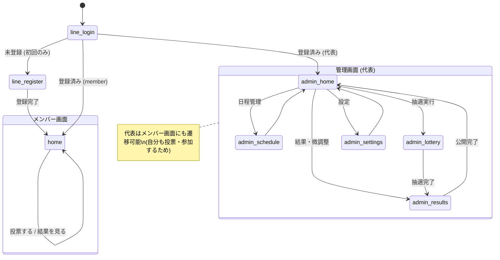

---
hide:
- navigation
doc_type: ui-design
version: 2.2.0
last_updated: '2026-09-25'
depends_on:
- requirements/index.md
- api-design/index.md
derived_by: []
sync_hash: e249dc7235de
dependency_hashes:
  requirements/index.md: 13f64cc9d35f
  api-design/index.md: ea8c5d33611d
---

# 画面設計書 — サークル練習参加抽選システム

## 1. 画面一覧

**全画面モバイルファースト**（D-009: メンバー・代表とも利用はスマホ前提。管理画面もスマホで完結する）。

| # | 画面ID | 画面名 | パス | 利用者 | 主な要件 |
|---|--------|--------|------|--------|----------|
| 1 | line-login | LINE ログイン / 初回登録 | /line | 全員 | REQ-001.1, 001.5, 002.1 |
| 2 | home | ホーム（投票・結果を兼ねる） | / | メンバー | REQ-004, REQ-006.1 |
| 3 | admin-home | 管理ホーム | /admin | 代表 | REQ-003, 005, 006.4 |
| 4 | admin-schedule | 練習日程管理 | /admin/schedule | 代表 | REQ-003 |
| 5 | admin-lottery | 抽選実行（枠設定を含む） | /admin/lottery | 代表 | REQ-005, 005.5, 005.12 |
| 6 | admin-results | 結果確認・微調整 | /admin/results | 代表 | REQ-006.2〜4 |
| 7 | admin-settings | 設定 | /admin/settings | 代表 | NFR-004.1, REQ-007.2〜3 |

メンバーがやることは「投票する」「結果を見る」の2つだけなので、投票画面・結果画面・プロフィール画面には分けず**ホーム1枚に集約**している。月の状態（投票受付中 / 締切後 / 公開後）で表示が切り替わる。

廃止した画面: login・register・verify（LINE ログインに一本化。D-042）、profile（本人によるプロフィール編集は行わない。REQ-002.2）、admin-roster（名簿機能の廃止。D-026）

## 2. 画面遷移図

未ログインで保護対象のパスを開くと `/line` へリダイレクトする。LINE アプリ内ブラウザで開かれた場合はログイン済みのため、画面を出さずにそのまま通過する。

## 3. 共通レイアウト

| レイアウト | 適用画面 | 構成 |
|------------|----------|------|
| auth | line-login | ロゴ + 中央カード。ヘッダーなし |
| default (member) | home | sticky ヘッダー（タイトル）+ コンテンツ。タブバーは持たない（画面が1枚のため） |
| default (admin) | admin-* | sticky ヘッダー（タイトル + 「管理」バッジ）+ コンテンツ + 下部タブバー（ホーム/日程/抽選/結果） |

共通ルール:

- ブランドカラー: `purple-600`。コンテンツ幅 `max-width: 480px; margin: 0 auto;`
- アイコンは絵文字を使わず、[Lucide](https://lucide.dev)（MITライセンスのフリー素材）のインラインSVGを埋め込む（外部参照は Tailwind CDN のみ許可のため、ホットリンクではなく埋め込み）
- ロゴ・モチーフはバレーボール（Lucide の volleyball アイコン）
- 日本語フォント: `-apple-system, BlinkMacSystemFont, "Hiragino Sans", "Hiragino Kaku Gothic ProN", Meiryo, sans-serif`
- タップターゲットは最小 44px。主要アクションは画面下部の固定ボタン
- 破壊的操作（抽選の再実行・練習日削除・メンバー無効化）は必ず確認ダイアログを挟む
- ステータスはバッジで表現: 投票中=green / 締切=gray / 抽選済=purple / 公開済=blue

## 4. 各画面詳細

### 4.1 line-login — LINE ログイン / 初回登録

- LIFF の Endpoint URL にこの画面を指定する。LINE アプリ内で開かれた場合はログイン済みのため、画面を出さずにそのまま通過する (D-021)
- 外部ブラウザで開かれた場合は LINE の認可画面へ遷移する
- 未登録なら初回登録フォームを表示する。入力は**本名・学年・性別・マネージャー区分の4項目のみ**（REQ-002.1）。LINE の表示名を「◯◯さん」と出して、誰として登録されるかを分かるようにする
- 本名を求める理由を画面に明記する（代表が抽選結果を確認するため）
- API: `POST /api/auth/line`（BFF 経由で `POST /auth/line/login`）、`POST /api/auth/line/register`
- 状態: loading / register / error

### 4.2 home — ホーム（メンバー）

投票画面・結果画面に分けず、月の状態で表示を切り替える1枚の画面。

- **投票受付中**: 練習日カードをタップで複数選択 → 下部固定の「この内容で投票する」で全置換投票 (REQ-004.2)。締切を常時表示する。備考のある日は投票前に見えるよう本文に出す (D-041)。学年限定の日は選択不可のグレー表示＋「◯年限定」ラベル (D-037)
- **締切後・結果未公開**: 「抽選結果を待っています」を表示する (REQ-006.4)
- **公開後**: 「自分の参加日」と「全員の参加表」をタブで切り替える (D-025)。既定は自分の参加日 (REQ-006.1)。参加表には参加しない人・未投票の人も並ぶ（マスは全て空欄: D-043）
- 閲覧専用アカウント (D-039) には「閲覧のみ（投票はできません）」を表示し、投票操作を出さない
- 代表には管理画面への導線を出す
- API: `GET /practice-months`, `GET /practice-months/{pmId}`, `GET/PUT .../votes/me`（409 = 締切後）, `GET .../results/me`, `GET .../participation`
- 状態: voting / voted / closed / published / observer / loading / error

<iframe src="snippets/home-mobile.html" width="100%" height="750px" frameborder="0" style="border: none; border-radius: 8px; box-shadow: 0 2px 8px rgba(0,0,0,0.1);"></iframe>

### 4.3 admin-home — 管理ホーム（代表）

- 月次ステータスのステップ表示（日程登録 → 投票受付 → 抽選 → 微調整 → 公開）で「次にやること」を明示
- 投票進捗カード（投票済み人数/対象人数）と各管理機能への導線
- API: `GET /practice-months`
- 状態: default / loading

<iframe src="snippets/admin-home-mobile.html" width="100%" height="800px" frameborder="0" style="border: none; border-radius: 8px; box-shadow: 0 2px 8px rgba(0,0,0,0.1);"></iframe>

### 4.4 admin-schedule — 練習日程管理（代表）

- 投票受付期間の設定 + 練習日行（日付・時間・場所・定員）の追加・編集・削除 (REQ-003)
- **投票期間は日付のみ入力**（開始日0:00〜締切日23:59。時刻は入力させない）(REQ-003.3 / D-014)
- **開始・終了時刻はプルダウンで30分刻み**（00:00〜23:30 の48択）(REQ-003.5 / D-014)
- **「よく使う練習から入力」プルダウン**を練習日フォームの先頭に置き、選ぶと場所・時刻・定員が自動入力される (REQ-003.6 / D-014)
- **複製**: 新規作成時は各行の「同じ内容で別日を追加」ボタン、既存月では練習日カードのコピーアイコンから、場所・時刻・定員を引き継いだ入力欄を開く。**日付は空**にする (REQ-003.7 / D-014)
- **新しい月の作成は確認画面を挟む**: 「入力内容を確認」→ 対象月・投票期間・練習日一覧（日付順）を表示 →「作成する」／「修正する」。同じ日付が重複していれば注意を表示する (REQ-003.8 / D-016)。既存月への練習日追加・編集には確認画面を挟まない
- 抽選実行後の削除は警告付き確認ダイアログ (REQ-003.4)
- API: `POST /practice-months`, `POST .../practices`, `PUT/DELETE /practices/{id}`, `GET /practices/suggestions`
- 状態: default / confirming / saving / warning-after-lottery

<iframe src="snippets/admin-schedule-mobile.html" width="100%" height="850px" frameborder="0" style="border: none; border-radius: 8px; box-shadow: 0 2px 8px rgba(0,0,0,0.1);"></iframe>

### 4.5 admin-lottery — 抽選実行（代表）

- **練習日ごとに、学年別の投票状況を積み上げ棒グラフで表示**し、その下で1年・2年・3年の参加人数を入力する (REQ-005.5 / D-015)
- 初期値はシステムの提案値（投票状況から自動算出）。代表は自由に増減できる (REQ-005.5.1)
- **合計が定員と一致するまで「参加人数を保存する」は押せない**。保存が済むまで「抽選を実行する」も無効
- 「抽選を実行する」ボタン。実行済みの場合は再実行の確認ダイアログ (REQ-005.12)
- 実行直後は結果カードを表示し、**その回の警告のみ**を出す。過去の実行履歴は画面に出さない (D-018)
- API: `GET .../vote-summary`, `PUT .../quotas`, `POST .../lottery`
- 状態: default / loading / quota-mismatch / saving / running / done / rerun-warning

<iframe src="snippets/admin-lottery-mobile.html" width="100%" height="850px" frameborder="0" style="border: none; border-radius: 8px; box-shadow: 0 2px 8px rgba(0,0,0,0.1);"></iframe>

### 4.6 admin-results — 結果確認・微調整（代表）

- 練習日別/メンバー別のタブ切替 (REQ-006.2)。参加者行には割当由来バッジ（3年確定/保証/配分/手動 等）
- メンバー別・表の両タブには**未投票のメンバーも並ぶ**。「未投票」バッジを付け、投票0・当選0で表示する。表タブでは全マスが「・」になる (D-043)
- 参加者の追加・削除で微調整 (REQ-006.3)。タップごとの確認ダイアログは出さない。定員超過は人数を灰色で示すだけで赤くしない (D-044)
- 未公開バナー + 「結果を公開する」ボタン (REQ-006.4)。公開済みの月で微調整すると「未反映の変更が N 件」の黄色バナーと「変更を再公開する（N件）」ボタンに切り替わる。表タブでは追加予定を黄色の●、削除予定を×で示し、×をもう一度タップすると戻る。確認ダイアログは公開・再公開のときだけ出す (D-044)
- API: `GET .../results`, `POST /practices/{id}/assignments`, `DELETE /assignments/{id}`, `POST .../publish`
- 状態: default / unpublished / published / capacity-warning

<iframe src="snippets/admin-results-mobile.html" width="100%" height="900px" frameborder="0" style="border: none; border-radius: 8px; box-shadow: 0 2px 8px rgba(0,0,0,0.1);"></iframe>

### 4.7 admin-settings — 設定（代表）

- 落選救済係数 α の編集 (NFR-004.1)
- 代表権限の移譲（メンバー選択 → 確認ダイアログ）(REQ-007.2)、メンバー無効化 (REQ-007.3)
- API: `GET/PUT /settings`, `PUT /users/{id}/role`, `DELETE /users/{id}`
- 状態: default / saving / confirm-dialog

<iframe src="snippets/admin-settings-mobile.html" width="100%" height="800px" frameborder="0" style="border: none; border-radius: 8px; box-shadow: 0 2px 8px rgba(0,0,0,0.1);"></iframe>

## 5. 要件トレーサビリティ

| 要件 | 対応画面 |
|------|----------|
| REQ-001 (認証) | line-login |
| REQ-002 (プロフィール) | line-login（初回登録のみ。編集画面は持たない） |
| REQ-003 (練習日程管理) | admin-schedule |
| REQ-004 (投票) | home |
| REQ-005 (抽選) | admin-lottery |
| REQ-005.5 (学年別枠の設定・提案値) | admin-lottery（投票状況の表示 + 枠の入力） |
| REQ-006.1 (本人結果) | home |
| REQ-006.2〜3 (代表の結果確認・微調整) | admin-results |
| REQ-006.4 (公開制御) | admin-results（公開ボタン）, home（未公開表示） |
| REQ-006.5 (参加表) | home（全員の参加表タブ: D-025） |
| REQ-007.2〜3 (権限・退会) | admin-settings |
| NFR-004.1 (設定変更) | admin-settings（α） |
| D-009 (モバイルファースト) | 全画面 |
