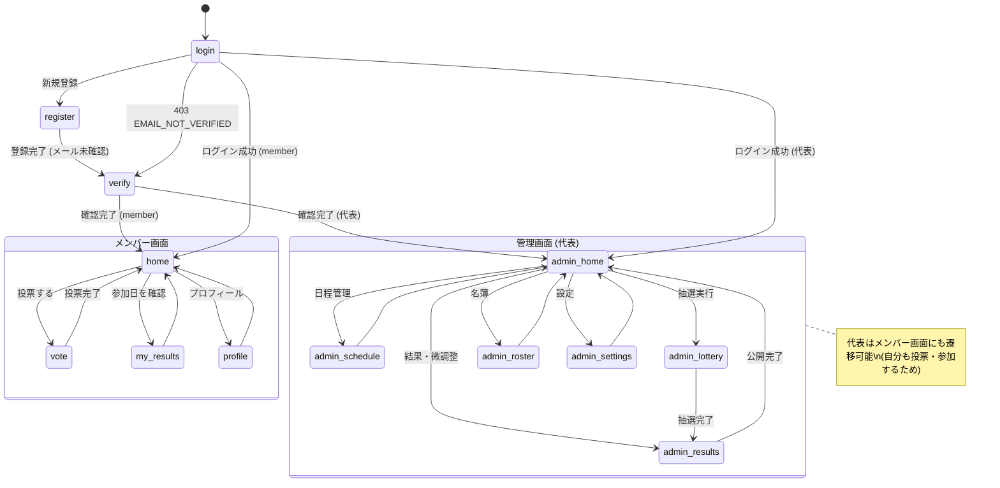

---
hide:
- navigation
doc_type: ui-design
version: 1.1.0
last_updated: '2026-07-08'
depends_on:
- requirements/index.md
- api-design/index.md
derived_by: []
sync_hash: bbac5fc60482
dependency_hashes:
  requirements/index.md: 2c207f7157b0
  api-design/index.md: 0e7b035ee359
---

# 画面設計書 — サークル練習参加抽選システム

## 1. 画面一覧

**全画面モバイルファースト**（D-009: メンバー・代表とも利用はスマホ前提。管理画面もスマホで完結する）。

| # | 画面ID | 画面名 | パス | 利用者 | 主な要件 |
|---|--------|--------|------|--------|----------|
| 1 | login | ログイン | /login | 全員 | REQ-001.2 |
| 2 | register | 新規登録 | /register | 全員 | REQ-001.1, 002.1 |
| 3 | home | ホーム | / | メンバー | REQ-004.4, 006.1 |
| 4 | vote | 投票 | /vote | メンバー | REQ-004 |
| 5 | my-results | 抽選結果 | /results | メンバー | REQ-006.1 |
| 6 | profile | プロフィール編集 | /profile | メンバー | REQ-002.2 |
| 7 | admin-home | 管理ホーム | /admin | 代表 | REQ-003, 005, 006.4 |
| 8 | admin-schedule | 練習日程管理 | /admin/schedule | 代表 | REQ-003 |
| 9 | admin-lottery | 抽選実行 | /admin/lottery | 代表 | REQ-005, 005.5, 005.12 |
| 10 | admin-results | 結果確認・微調整 | /admin/results | 代表 | REQ-006.2〜4 |
| 11 | admin-roster | 名簿 | /admin/roster | 代表 | REQ-007.1 |
| 12 | admin-settings | 設定 | /admin/settings | 代表 | NFR-004.1, REQ-007.2〜3 |
| 13 | verify | メールアドレス確認 | /verify | 全員 | REQ-001.5, 001.6 |

※ 13 は後から追加した画面。フロー上は register の直後に位置する（既存の番号を維持するため末尾に記載）

## 2. 画面遷移図

## 3. 共通レイアウト

| レイアウト | 適用画面 | 構成 |
|------------|----------|------|
| auth | login, register, verify | ロゴ + 中央カード。ヘッダーなし |
| default (member) | home, vote, my-results, profile | sticky ヘッダー（タイトル）+ コンテンツ + 下部タブバー（ホーム/投票/結果/プロフィール） |
| default (admin) | admin-* | sticky ヘッダー（タイトル + 「管理」バッジ）+ コンテンツ + 下部タブバー（ホーム/日程/抽選/結果/名簿） |

共通ルール:

- ブランドカラー: `purple-600`。コンテンツ幅 `max-width: 480px; margin: 0 auto;`
- アイコンは絵文字を使わず、[Lucide](https://lucide.dev)（MITライセンスのフリー素材）のインラインSVGを埋め込む（外部参照は Tailwind CDN のみ許可のため、ホットリンクではなく埋め込み）
- ロゴ・モチーフはバレーボール（Lucide の volleyball アイコン）
- 日本語フォント: `-apple-system, BlinkMacSystemFont, "Hiragino Sans", "Hiragino Kaku Gothic ProN", Meiryo, sans-serif`
- タップターゲットは最小 44px。主要アクションは画面下部の固定ボタン
- 破壊的操作（抽選の再実行・練習日削除・メンバー無効化）は必ず確認ダイアログを挟む
- ステータスはバッジで表現: 投票中=green / 締切=gray / 抽選済=purple / 公開済=blue

## 4. 各画面詳細

### 4.1 login — ログイン

- メールアドレス + パスワードでログイン (REQ-001.2)。エラー時はカード上部にメッセージ表示
- API: `POST /auth/login` → 成功時にロールで遷移先を分岐（member → home / representative → admin-home）
- **403 `EMAIL_NOT_VERIFIED`** の場合はエラー表示ではなく verify 画面へ遷移し、確認コードの入力を促す（D-012）
- 状態: default / loading / error

<iframe src="snippets/login-mobile.html" width="100%" height="700px" frameborder="0" style="border: none; border-radius: 8px; box-shadow: 0 2px 8px rgba(0,0,0,0.1);"></iframe>

### 4.2 register — 新規登録

- プロフィール9項目を含む登録フォーム (REQ-001.1, REQ-002.1)。学年は1〜3年のみ
- **パスワードは2回入力**させ、不一致なら送信前にエラー表示する (REQ-001.7 / D-014)
- API: `POST /auth/register` → 成功時は自動ログインせず **verify 画面へ遷移**（登録直後はメール未確認のため: D-011）
- 状態: default / loading / error

<iframe src="snippets/register-mobile.html" width="100%" height="900px" frameborder="0" style="border: none; border-radius: 8px; box-shadow: 0 2px 8px rgba(0,0,0,0.1);"></iframe>

### 4.3 home — ホーム（メンバー）

- 今月の投票状況カード（投票済み/未投票・締切カウントダウン）と次の参加練習カード
- API: `GET /practice-months`, `GET .../votes/me`, `GET .../results/me`
- 状態: default / empty（練習未登録月）/ loading

<iframe src="snippets/home-mobile.html" width="100%" height="750px" frameborder="0" style="border: none; border-radius: 8px; box-shadow: 0 2px 8px rgba(0,0,0,0.1);"></iframe>

### 4.4 vote — 投票

- 練習日カードをタップで複数選択 → 下部固定の「この内容で投票する」で全置換投票 (REQ-004.2)
- 締切バナー常時表示。締切後は選択不可 + 「締切済み」表示 (REQ-004.3)
- API: `GET /practice-months/{pmId}`, `PUT .../votes/me`（409 = 締切後）
- 状態: default / voted / closed / loading / error

<iframe src="snippets/vote-mobile.html" width="100%" height="850px" frameborder="0" style="border: none; border-radius: 8px; box-shadow: 0 2px 8px rgba(0,0,0,0.1);"></iframe>

### 4.5 my-results — 抽選結果（メンバー）

- 自分の参加日をカードリストで表示（日付・時間・場所）(REQ-006.1)
- 未公開時は「結果はまだ公開されていません」(REQ-006.4)
- API: `GET .../results/me`（404 = 未公開）
- 状態: default / unpublished / empty / loading

<iframe src="snippets/my-results-mobile.html" width="100%" height="750px" frameborder="0" style="border: none; border-radius: 8px; box-shadow: 0 2px 8px rgba(0,0,0,0.1);"></iframe>

### 4.6 profile — プロフィール編集

- 本人が編集可能な項目のみ（メールアドレスは表示のみ）。ログアウトボタンを含む
- API: `GET /users/me`, `PUT /users/me`
- 状態: default / saving / error

<iframe src="snippets/profile-mobile.html" width="100%" height="850px" frameborder="0" style="border: none; border-radius: 8px; box-shadow: 0 2px 8px rgba(0,0,0,0.1);"></iframe>

### 4.7 admin-home — 管理ホーム（代表）

- 月次ステータスのステップ表示（日程登録 → 投票受付 → 抽選 → 微調整 → 公開）で「次にやること」を明示
- 投票進捗カード（投票済み人数/対象人数）と各管理機能への導線
- API: `GET /practice-months`
- 状態: default / loading

<iframe src="snippets/admin-home-mobile.html" width="100%" height="800px" frameborder="0" style="border: none; border-radius: 8px; box-shadow: 0 2px 8px rgba(0,0,0,0.1);"></iframe>

### 4.8 admin-schedule — 練習日程管理（代表）

- 投票受付期間の設定 + 練習日行（日付・時間・場所・定員）の追加・編集・削除 (REQ-003)
- **投票期間は日付のみ入力**（開始日0:00〜締切日23:59。時刻は入力させない）(REQ-003.3 / D-014)
- **開始・終了時刻はプルダウンで30分刻み**（00:00〜23:30 の48択）(REQ-003.5 / D-014)
- **「よく使う練習から入力」プルダウン**を練習日フォームの先頭に置き、選ぶと場所・時刻・定員が自動入力される (REQ-003.6 / D-014)
- **複製**: 新規作成時は各行の「同じ内容で別日を追加」ボタン、既存月では練習日カードのコピーアイコンから、場所・時刻・定員を引き継いだ入力欄を開く。**日付は空**にする (REQ-003.7 / D-014)
- **新しい月の作成は確認画面を挟む**: 「入力内容を確認」→ 対象月・投票期間・練習日一覧（日付順）を表示 →「作成する」／「修正する」。同じ日付が重複していれば注意を表示する (REQ-003.8 / D-016)。既存月への練習日追加・編集には確認画面を挟まない
- 抽選実行後の削除は警告付き確認ダイアログ (REQ-003.4)
- API: `POST /practice-months`, `POST .../practices`, `PUT/DELETE /practices/{id}`, `GET /practices/suggestions`
- 状態: default / confirming / saving / warning-after-lottery

<iframe src="snippets/admin-schedule-mobile.html" width="100%" height="850px" frameborder="0" style="border: none; border-radius: 8px; box-shadow: 0 2px 8px rgba(0,0,0,0.1);"></iframe>

### 4.9 admin-lottery — 抽選実行（代表）

- **練習日ごとに、学年別の投票状況を積み上げ棒グラフで表示**し、その下で1年・2年・3年の参加人数を入力する (REQ-005.5 / D-015)
- 初期値はシステムの提案値（投票状況から自動算出）。代表は自由に増減できる (REQ-005.5.1)
- **合計が定員と一致するまで「参加人数を保存する」は押せない**。保存が済むまで「抽選を実行する」も無効
- 「抽選を実行する」ボタン。実行済みの場合は再実行の確認ダイアログ (REQ-005.12)
- 実行直後は結果カードを表示し、**その回の警告のみ**を出す。過去の実行履歴は画面に出さない (D-018)
- API: `GET .../vote-summary`, `PUT .../quotas`, `POST .../lottery`
- 状態: default / loading / quota-mismatch / saving / running / done / rerun-warning

<iframe src="snippets/admin-lottery-mobile.html" width="100%" height="850px" frameborder="0" style="border: none; border-radius: 8px; box-shadow: 0 2px 8px rgba(0,0,0,0.1);"></iframe>

### 4.10 admin-results — 結果確認・微調整（代表）

- 練習日別/メンバー別のタブ切替 (REQ-006.2)。参加者行には割当由来バッジ（3年確定/保証/配分/手動 等）
- 参加者の追加・削除で微調整 (REQ-006.3)。定員超過時は警告色のインジケーター
- 未公開バナー + 「結果を公開する」ボタン (REQ-006.4)
- API: `GET .../results`, `POST /practices/{id}/assignments`, `DELETE /assignments/{id}`, `POST .../publish`
- 状態: default / unpublished / published / capacity-warning

<iframe src="snippets/admin-results-mobile.html" width="100%" height="900px" frameborder="0" style="border: none; border-radius: 8px; box-shadow: 0 2px 8px rgba(0,0,0,0.1);"></iframe>

### 4.11 admin-roster — 名簿（代表）

- 検索（名前・学籍番号）+ 学年/マネージャーフィルタ (REQ-007.1.1)。男女全体を表示 (D-008)
- メンバーカードはタップで全項目（住所・電話番号等）を展開表示（スマホで表を横スクロールさせない）
- CSVエクスポートボタン（絞り込み結果を反映）(REQ-007.1.2)
- API: `GET /users`, `GET /users/export`
- 状態: default / empty / loading

<iframe src="snippets/admin-roster-mobile.html" width="100%" height="850px" frameborder="0" style="border: none; border-radius: 8px; box-shadow: 0 2px 8px rgba(0,0,0,0.1);"></iframe>

### 4.12 admin-settings — 設定（代表）

- 落選救済係数 α の編集 (NFR-004.1)
- 代表権限の移譲（メンバー選択 → 確認ダイアログ）(REQ-007.2)、メンバー無効化 (REQ-007.3)
- API: `GET/PUT /settings`, `PUT /users/{id}/role`, `DELETE /users/{id}`
- 状態: default / saving / confirm-dialog

<iframe src="snippets/admin-settings-mobile.html" width="100%" height="800px" frameborder="0" style="border: none; border-radius: 8px; box-shadow: 0 2px 8px rgba(0,0,0,0.1);"></iframe>

### 4.13 verify — メールアドレス確認

- 登録後に届いた6桁コードを入力して登録を完了する (REQ-001.5)。宛先メールアドレスを画面上部に表示する
- 入力欄は `inputmode="numeric"` / `maxlength=6`。スマホで数字キーボードが開くようにする（D-009・D-012 でリンク方式ではなくコード方式を選んだ理由に対応）
- 「コードを再送する」で新しいコードを発行 (REQ-001.6)。有効期限15分・失敗5回で無効化である旨を画面に明示する
- API: `POST /auth/verify`, `POST /auth/verify/resend` → 確認完了時にトークンが発行されるため、**login 画面へは戻さずそのままホーム（代表は管理ホーム）へ遷移**する (D-014)
- エラー表示: `INVALID_CODE`（コード誤り）/ `CODE_EXPIRED`（期限切れ→再送を促す）/ `CODE_LOCKED`（失敗上限→再送を促す）
- 状態: default / loading / error / resent

<iframe src="snippets/verify-mobile.html" width="100%" height="700px" frameborder="0" style="border: none; border-radius: 8px; box-shadow: 0 2px 8px rgba(0,0,0,0.1);"></iframe>

## 5. 要件トレーサビリティ

| 要件 | 対応画面 |
|------|----------|
| REQ-001 (認証) | login, register, verify, profile (ログアウト) |
| REQ-001.5〜6 (メール確認・再送) | verify |
| REQ-002 (プロフィール) | register, profile |
| REQ-003 (練習日程管理) | admin-schedule |
| REQ-004 (投票) | home, vote |
| REQ-005 (抽選) | admin-lottery |
| REQ-005.5 (枠比率・期待値) | admin-lottery（スライダー + 期待値表示） |
| REQ-006.1 (本人結果) | home, my-results |
| REQ-006.2〜3 (代表の結果確認・微調整) | admin-results |
| REQ-006.4 (公開制御) | admin-results（公開ボタン）, my-results（未公開表示） |
| REQ-007.1 (名簿) | admin-roster |
| REQ-007.2〜3 (権限・退会) | admin-settings |
| NFR-004.1 (設定変更) | admin-lottery（枠比率）, admin-settings（α） |
| D-009 (モバイルファースト) | 全画面 |
